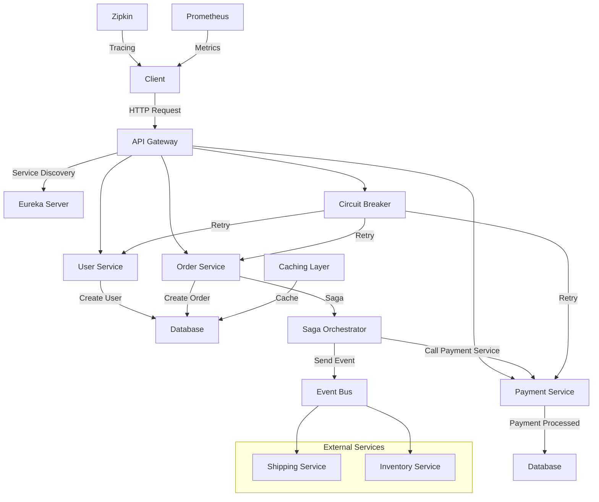
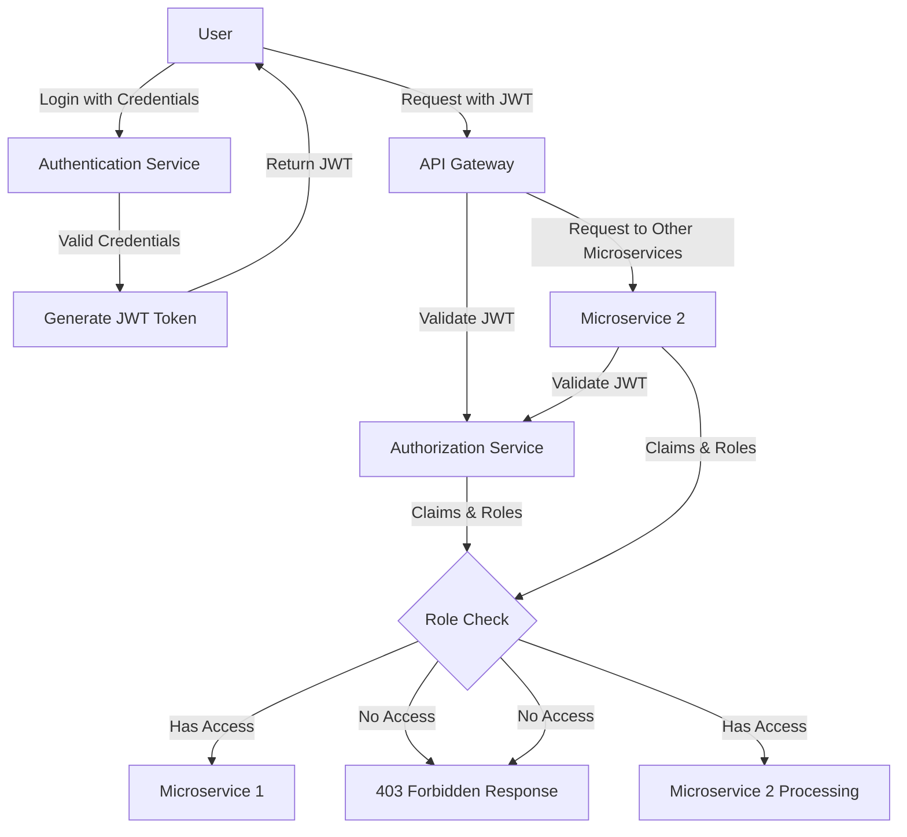
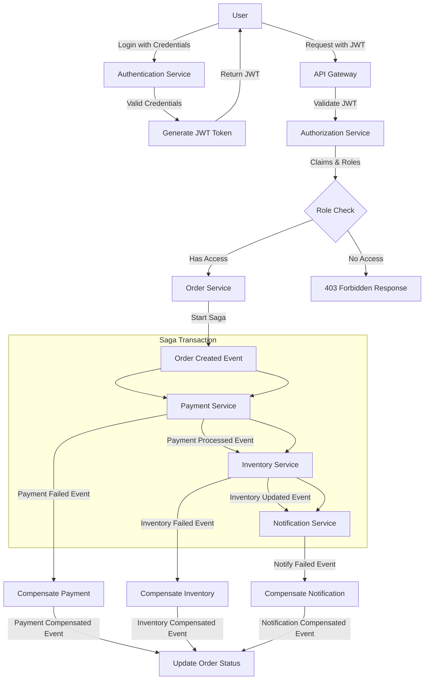
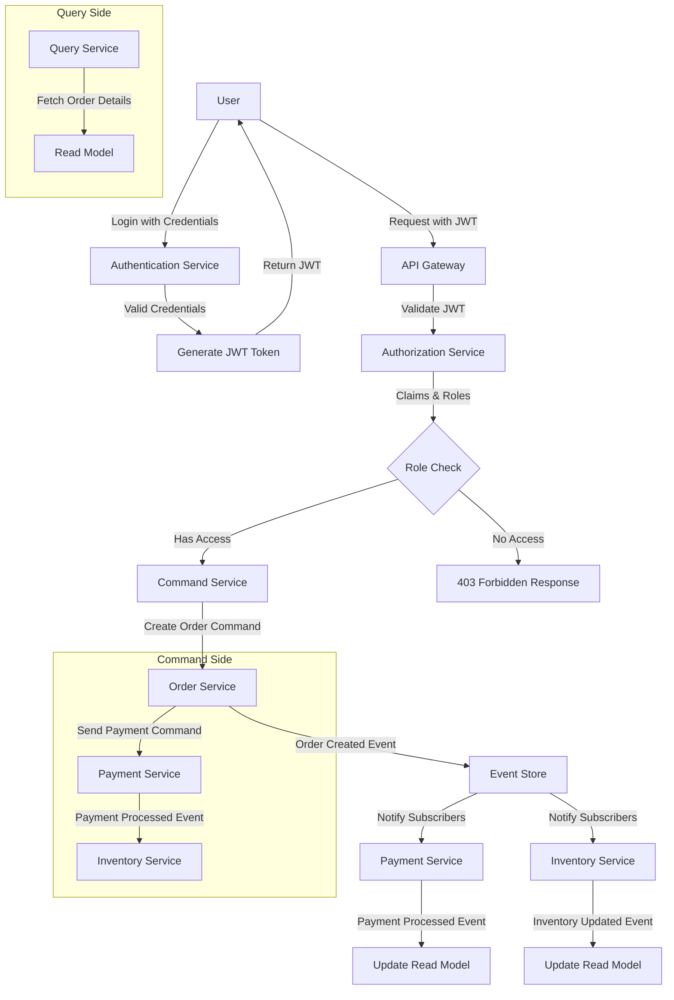

Designing an API in Spring Boot involves several key steps. Here’s a structured approach to guide you through the process:

### 1. Define Requirements

- **Understand the Use Case**: Gather requirements for what the API needs to accomplish.
- **Identify Resources**: Determine the resources (e.g., users, products) your API will manage.

### 2. Set Up Your Spring Boot Project

- **Create a Spring Boot Application**: Use Spring Initializr (https://start.spring.io/) to bootstrap your application.
  - Select dependencies such as Spring Web, Spring Data JPA, and any database driver (e.g., H2, MySQL).
- **Import the Project**: Import the generated project into your IDE (e.g., IntelliJ IDEA, Eclipse).

### 3. Define API Structure

- **Design API Endpoints**: Decide on the endpoints, HTTP methods (GET, POST, PUT, DELETE), and their paths. For example:
  - `GET /api/users` - Retrieve all users
  - `POST /api/users` - Create a new user
  - `GET /api/users/{id}` - Retrieve a specific user
  - `PUT /api/users/{id}` - Update a specific user
  - `DELETE /api/users/{id}` - Delete a specific user

### 4. Implement the Model

- **Create Entity Classes**: Define your data model using JPA annotations.
  ```java
  @Entity
  public class User {
      @Id
      @GeneratedValue(strategy = GenerationType.IDENTITY)
      private Long id;
      private String name;
      private String email;
      // Getters and Setters
  }
  ```

### 5. Set Up the Repository

- **Create Repository Interfaces**: Use Spring Data JPA to interact with the database.
  ```java
  public interface UserRepository extends JpaRepository<User, Long> {
      // Custom query methods can be added here
  }
  ```

### 6. Implement the Service Layer

- **Create Service Classes**: Implement business logic in service classes, which interact with the repository.
  ```java
  @Service
  public class UserService {
      @Autowired
      private UserRepository userRepository;

      public List<User> getAllUsers() {
          return userRepository.findAll();
      }

      public User createUser(User user) {
          return userRepository.save(user);
      }
      // Additional methods
  }
  ```

### 7. Create Controllers

- **Implement Controller Classes**: Define REST controllers to handle incoming requests and map them to service methods.
  ```java
  @RestController
  @RequestMapping("/api/users")
  public class UserController {
      @Autowired
      private UserService userService;

      @GetMapping
      public List<User> getAllUsers() {
          return userService.getAllUsers();
      }

      @PostMapping
      public User createUser(@RequestBody User user) {
          return userService.createUser(user);
      }
      // Additional endpoints
  }
  ```

### 8. Add Error Handling

- **Global Exception Handling**: Implement a global exception handler using `@ControllerAdvice` to manage errors consistently.
  ```java
  @ControllerAdvice
  public class GlobalExceptionHandler {
      @ExceptionHandler(ResourceNotFoundException.class)
      public ResponseEntity<?> handleResourceNotFound(ResourceNotFoundException ex) {
          return ResponseEntity.status(HttpStatus.NOT_FOUND).body(ex.getMessage());
      }
      // Additional handlers
  }
  ```

### 9. Security (Optional)

- **Implement Security**: Use Spring Security to secure your API endpoints if necessary. Configure authentication and authorization based on your requirements.

### 10. Testing

- **Write Unit and Integration Tests**: Use JUnit and Spring’s testing support to ensure your API works as expected. Focus on testing controllers, services, and repositories.

### 11. Documentation

- **Document Your API**: Use tools like Swagger (Springfox) or OpenAPI to generate API documentation automatically.

### 12. Deployment

- **Package and Deploy**: Build your Spring Boot application into a JAR file and deploy it to your server or cloud platform.

### 13. Monitor and Maintain

- **Logging and Monitoring**: Integrate logging (using SLF4J or Logback) and monitoring solutions (like Spring Boot Actuator) to keep track of your API's health and performance.

### Conclusion

By following these steps, you can design and implement a robust API in Spring Boot, ensuring that it meets the functional and non-functional requirements of your application.

Configuring an H2 database in a Spring Boot REST application is straightforward. Here’s a step-by-step guide to help you set it up:

### Step 1: Create a Spring Boot Project

You can use Spring Initializr to create a new Spring Boot project. Include the following dependencies:

- Spring Web
- Spring Data JPA
- H2 Database

### Step 2: Update `application.properties`

Open the `src/main/resources/application.properties` file and add the following configurations:

```properties
# H2 Database Configuration
spring.datasource.url=jdbc:h2:mem:testdb;DB_CLOSE_DELAY=-1;DB_CLOSE_ON_EXIT=FALSE
spring.datasource.driver-class-name=org.h2.Driver
spring.datasource.username=sa
spring.datasource.password=

# JPA Configuration
spring.jpa.hibernate.ddl-auto=update
spring.jpa.show-sql=true

# H2 Console Configuration
spring.h2.console.enabled=true
spring.h2.console.path=/h2-console
```

### Step 3: Create Entity Classes

Define your data model using JPA annotations. Here’s an example `User` entity:

```java
import javax.persistence.Entity;
import javax.persistence.GeneratedValue;
import javax.persistence.GenerationType;
import javax.persistence.Id;

@Entity
public class User {
    @Id
    @GeneratedValue(strategy = GenerationType.IDENTITY)
    private Long id;
    private String name;
    private String email;

    // Getters and Setters
}
```

### Step 4: Create Repository Interface

Create a repository interface that extends `JpaRepository`:

```java
import org.springframework.data.jpa.repository.JpaRepository;

public interface UserRepository extends JpaRepository<User, Long> {
}
```

### Step 5: Implement the Service Layer

Create a service class to handle business logic:

```java
import org.springframework.beans.factory.annotation.Autowired;
import org.springframework.stereotype.Service;

import java.util.List;

@Service
public class UserService {
    @Autowired
    private UserRepository userRepository;

    public List<User> getAllUsers() {
        return userRepository.findAll();
    }

    public User createUser(User user) {
        return userRepository.save(user);
    }
}
```

### Step 6: Create a REST Controller

Create a REST controller to expose the API:

```java
import org.springframework.beans.factory.annotation.Autowired;
import org.springframework.web.bind.annotation.*;

import java.util.List;

@RestController
@RequestMapping("/api/users")
public class UserController {
    @Autowired
    private UserService userService;

    @GetMapping
    public List<User> getAllUsers() {
        return userService.getAllUsers();
    }

    @PostMapping
    public User createUser(@RequestBody User user) {
        return userService.createUser(user);
    }
}
```

### Step 7: Run the Application

Run your Spring Boot application. You can do this from your IDE or by executing the command:

```bash
mvn spring-boot:run
```

### Step 8: Access the H2 Console

To access the H2 database console, open a web browser and navigate to:

```
http://localhost:8080/h2-console
```

Use the following settings to log in:

- **JDBC URL**: `jdbc:h2:mem:testdb`
- **User Name**: `sa`
- **Password**: (leave it blank)

### Step 9: Test the API

You can use tools like Postman or curl to test your REST API. For example:

- **Get all users**:
  - **GET**: `http://localhost:8080/api/users`
  
- **Create a new user**:
  - **POST**: `http://localhost:8080/api/users`
  - **Body**:
    ```json
    {
        "name": "John Doe",
        "email": "john.doe@example.com"
    }
    ```

### Conclusion

You now have a Spring Boot REST application configured with an H2 database. This setup is useful for development and testing purposes, as it provides an in-memory database that is easy to use and configure.

Creating an HTTPS-secure API using Spring Boot involves several steps, including generating an SSL certificate, configuring Spring Boot to use HTTPS, and ensuring your REST API endpoints are secured. Here’s a step-by-step guide:

### Step 1: Generate an SSL Certificate

For development purposes, you can create a self-signed certificate using the Java `keytool` utility. Open your terminal and run:

```bash
keytool -genkeypair -alias myapi -keyalg RSA -keystore myapi.jks -keysize 2048
```

Follow the prompts to provide details like the keystore password, your name, organization, etc. This command creates a file named `myapi.jks`.

### Step 2: Add the Keystore to Your Spring Boot Project

Place the `myapi.jks` file in the `src/main/resources` directory of your Spring Boot project.

### Step 3: Configure `application.properties`

Open your `src/main/resources/application.properties` file and add the following configurations:

```properties
# Server Configuration
server.port=8443
server.ssl.key-store=classpath:myapi.jks
server.ssl.key-store-password=your_keystore_password
server.ssl.key-store-type=JKS
server.ssl.key-alias=myapi
```

### Step 4: Create a Spring Boot REST API

Here’s a simple example of a REST controller:

```java
import org.springframework.web.bind.annotation.GetMapping;
import org.springframework.web.bind.annotation.RestController;

@RestController
public class MyController {

    @GetMapping("/api/hello")
    public String hello() {
        return "Hello, HTTPS World!";
    }
}
```

### Step 5: Run Your Application

Run your Spring Boot application. You can do this from your IDE or by executing:

```bash
mvn spring-boot:run
```

### Step 6: Test Your HTTPS API

Open a web browser or use a tool like Postman to test your API at:

```
https://localhost:8443/api/hello
```

Since you’re using a self-signed certificate, you may see a warning about the certificate not being trusted. You can usually proceed to access the site anyway.

### Step 7: Optional - Redirect HTTP to HTTPS

If you want to redirect HTTP requests to HTTPS, you can add a simple configuration:

1. Add the following to your `application.properties`:

```properties
server.port=8080
```

2. Create a configuration class to handle the redirect:

```java
import org.springframework.boot.web.embedded.tomcat.TomcatServletWebServerFactory;
import org.springframework.boot.web.server.WebServerFactoryCustomizer;
import org.springframework.context.annotation.Bean;
import org.springframework.context.annotation.Configuration;
import org.springframework.web.servlet.config.annotation.ViewControllersConfigurer;

@Configuration
public class WebServerConfig {

    @Bean
    public WebServerFactoryCustomizer<TomcatServletWebServerFactory> customizer() {
        return factory -> factory.addContextCustomizers(context -> context.addLifecycleListener(event -> {
            if (event instanceof org.apache.catalina.LifecycleEvent) {
                if (event.getType().equals(org.apache.catalina.Lifecycle.CONFIGURE_START_EVENT)) {
                    context.setSecure(true);
                    context.setScheme("https");
                }
            }
        }));
    }
}
```

### Conclusion

You now have a Spring Boot application with an HTTPS-secure REST API. This setup uses a self-signed certificate suitable for development. For production, you should obtain a trusted SSL certificate from a Certificate Authority (CA). Remember to configure your domain and DNS settings appropriately when deploying to production.

Securing microservices using OAuth 2.0 and JWT (JSON Web Tokens) is a robust way to manage authentication and authorization. Here’s a step-by-step guide on how to implement this in a Spring Boot environment.

### Overview

1. **OAuth 2.0**: A protocol that allows third-party applications to obtain limited access to an HTTP service.
2. **JWT**: A compact, URL-safe means of representing claims to be transferred between two parties.

### Step 1: Set Up Your Microservices

Create multiple Spring Boot applications for your microservices. For example, you might have:

- **Auth Service**: Handles user authentication and issues JWT tokens.
- **Resource Service**: A protected microservice that requires a valid token to access.

### Step 2: Add Dependencies

Add the necessary dependencies to your `pom.xml` files for both services.

#### Auth Service

```xml
<dependency>
    <groupId>org.springframework.boot</groupId>
    <artifactId>spring-boot-starter-security</artifactId>
</dependency>
<dependency>
    <groupId>org.springframework.boot</groupId>
    <artifactId>spring-boot-starter-oauth2-client</artifactId>
</dependency>
<dependency>
    <groupId>io.jsonwebtoken</groupId>
    <artifactId>jjwt</artifactId>
    <version>0.9.1</version>
</dependency>
```

#### Resource Service

```xml
<dependency>
    <groupId>org.springframework.boot</groupId>
    <artifactId>spring-boot-starter-security</artifactId>
</dependency>
<dependency>
    <groupId>io.jsonwebtoken</groupId>
    <artifactId>jjwt</artifactId>
    <version>0.9.1</version>
</dependency>
```

### Step 3: Configure the Auth Service

#### 1. Create a User Model and Repository

Define a User model and a repository to handle user data.

```java
@Entity
public class User {
    @Id
    private Long id;
    private String username;
    private String password; // Store hashed passwords
}
```

#### 2. Create a JWT Utility Class

Implement a utility class for generating and validating JWT tokens.

```java
import io.jsonwebtoken.Claims;
import io.jsonwebtoken.Jwts;
import io.jsonwebtoken.SignatureAlgorithm;
import org.springframework.stereotype.Component;

import java.util.Date;
import java.util.HashMap;
import java.util.Map;

@Component
public class JwtUtil {
    private String SECRET_KEY = "your_secret_key";

    public String generateToken(String username) {
        Map<String, Object> claims = new HashMap<>();
        return createToken(claims, username);
    }

    private String createToken(Map<String, Object> claims, String subject) {
        return Jwts.builder()
                .setClaims(claims)
                .setSubject(subject)
                .setIssuedAt(new Date(System.currentTimeMillis()))
                .setExpiration(new Date(System.currentTimeMillis() + 1000 * 60 * 60 * 10)) // 10 hours
                .signWith(SignatureAlgorithm.HS256, SECRET_KEY)
                .compact();
    }

    public Boolean validateToken(String token, String username) {
        final String extractedUsername = extractUsername(token);
        return (extractedUsername.equals(username) && !isTokenExpired(token));
    }

    private String extractUsername(String token) {
        return extractAllClaims(token).getSubject();
    }

    private Claims extractAllClaims(String token) {
        return Jwts.parser().setSigningKey(SECRET_KEY).parseClaimsJws(token).getBody();
    }

    private Boolean isTokenExpired(String token) {
        return extractAllClaims(token).getExpiration().before(new Date());
    }
}
```

#### 3. Implement Authentication Logic

Create a controller to handle login requests and return JWT tokens.

```java
@RestController
@RequestMapping("/auth")
public class AuthController {
    @Autowired
    private JwtUtil jwtUtil;

    @PostMapping("/login")
    public ResponseEntity<String> login(@RequestBody User user) {
        // Validate user credentials (this is a simplified example)
        String token = jwtUtil.generateToken(user.getUsername());
        return ResponseEntity.ok(token);
    }
}
```

### Step 4: Configure the Resource Service

#### 1. Create a Filter for JWT Validation

Implement a filter to intercept incoming requests and validate the JWT.

```java
import org.springframework.beans.factory.annotation.Autowired;
import org.springframework.security.authentication.UsernamePasswordAuthenticationToken;
import org.springframework.security.core.context.SecurityContextHolder;
import org.springframework.security.core.userdetails.UserDetailsService;
import org.springframework.stereotype.Component;
import org.springframework.web.filter.OncePerRequestFilter;

import javax.servlet.FilterChain;
import javax.servlet.ServletException;
import javax.servlet.http.HttpServletRequest;
import javax.servlet.http.HttpServletResponse;
import java.io.IOException;

@Component
public class JwtRequestFilter extends OncePerRequestFilter {
    @Autowired
    private JwtUtil jwtUtil;

    @Autowired
    private UserDetailsService userDetailsService;

    @Override
    protected void doFilterInternal(HttpServletRequest request, HttpServletResponse response, FilterChain chain)
            throws ServletException, IOException {
        final String authorizationHeader = request.getHeader("Authorization");

        String username = null;
        String jwt = null;

        if (authorizationHeader != null && authorizationHeader.startsWith("Bearer ")) {
            jwt = authorizationHeader.substring(7);
            username = jwtUtil.extractUsername(jwt);
        }

        if (username != null && SecurityContextHolder.getContext().getAuthentication() == null) {
            // You can load user details here if needed
            UsernamePasswordAuthenticationToken authToken = new UsernamePasswordAuthenticationToken(username, null, new ArrayList<>());
            SecurityContextHolder.getContext().setAuthentication(authToken);
        }
        chain.doFilter(request, response);
    }
}
```

#### 2. Configure Security in the Resource Service

Set up security to use the JWT filter.

```java
import org.springframework.beans.factory.annotation.Autowired;
import org.springframework.context.annotation.Bean;
import org.springframework.context.annotation.Configuration;
import org.springframework.security.config.annotation.authentication.builders.AuthenticationManagerBuilder;
import org.springframework.security.config.annotation.web.builders.HttpSecurity;
import org.springframework.security.config.annotation.web.configuration.EnableWebSecurity;
import org.springframework.security.config.annotation.web.configuration.WebSecurityConfigurerAdapter;
import org.springframework.security.config.http.SessionCreationPolicy;
import org.springframework.security.web.authentication.UsernamePasswordAuthenticationFilter;

@Configuration
@EnableWebSecurity
public class SecurityConfig extends WebSecurityConfigurerAdapter {
    @Autowired
    private JwtRequestFilter jwtRequestFilter;

    @Override
    protected void configure(HttpSecurity http) throws Exception {
        http.csrf().disable()
            .authorizeRequests()
            .antMatchers("/auth/**").permitAll() // Allow auth endpoints
            .anyRequest().authenticated() // Secure all other endpoints
            .and()
            .sessionManagement().sessionCreationPolicy(SessionCreationPolicy.STATELESS);
        
        http.addFilterBefore(jwtRequestFilter, UsernamePasswordAuthenticationFilter.class);
    }
}
```

### Step 5: Test Your Setup

1. **Start the Auth Service** and the **Resource Service**.
2. **Login** to get a JWT:
   - POST to `http://localhost:8080/auth/login` with a JSON body like:
     ```json
     {
       "username": "your_username",
       "password": "your_password"
     }
     ```

3. **Access a Protected Resource**:
   - Use the received token in the `Authorization` header (as `Bearer <token>`) to access secured endpoints in the Resource Service.

### Conclusion

By following these steps, you can secure your microservices architecture using OAuth 2.0 and JWT in a Spring Boot application. This approach ensures that each service is independently secured while providing a seamless authentication experience for users. For production systems, consider using a dedicated OAuth 2.0 provider like Keycloak, Okta, or Auth0 for enhanced security features and management.

Design patterns play a crucial role in structuring and organizing code in Spring Boot microservices. Here are some common design patterns along with examples of how they can be applied in a Spring Boot microservice context:

### 1. **Singleton Pattern**

**Use Case**: Ensuring that a class has only one instance and providing a global point of access to it.

**Example**:
In Spring, beans are singleton by default. You can define a service that manages configurations.

```java
import org.springframework.stereotype.Service;

@Service
public class ConfigurationService {
    // Singleton instance
    private String configValue;

    public String getConfigValue() {
        return configValue;
    }

    public void setConfigValue(String configValue) {
        this.configValue = configValue;
    }
}
```

### 2. **Factory Pattern**

**Use Case**: Creating objects without specifying the exact class of object that will be created.

**Example**:
Using a factory to create different types of payment processors.

```java
public interface PaymentProcessor {
    void processPayment();
}

public class PayPalProcessor implements PaymentProcessor {
    public void processPayment() {
        // PayPal payment logic
    }
}

public class StripeProcessor implements PaymentProcessor {
    public void processPayment() {
        // Stripe payment logic
    }
}

public class PaymentProcessorFactory {
    public static PaymentProcessor getProcessor(String type) {
        switch (type) {
            case "paypal":
                return new PayPalProcessor();
            case "stripe":
                return new StripeProcessor();
            default:
                throw new IllegalArgumentException("Unknown payment type");
        }
    }
}
```

### 3. **Adapter Pattern**

**Use Case**: Allowing incompatible interfaces to work together.

**Example**:
Integrating an external service with a different API.

```java
public interface ExternalService {
    String fetchData();
}

public class LegacyService {
    public String getData() {
        return "data from legacy service";
    }
}

public class ExternalServiceAdapter implements ExternalService {
    private final LegacyService legacyService;

    public ExternalServiceAdapter(LegacyService legacyService) {
        this.legacyService = legacyService;
    }

    @Override
    public String fetchData() {
        return legacyService.getData();
    }
}
```

### 4. **Observer Pattern**

**Use Case**: Allowing an object to notify other objects about changes in its state.

**Example**:
Implementing event publishing in a microservice.

```java
import org.springframework.context.ApplicationEvent;
import org.springframework.context.ApplicationEventPublisher;
import org.springframework.stereotype.Service;

@Service
public class UserService {
    private final ApplicationEventPublisher publisher;

    public UserService(ApplicationEventPublisher publisher) {
        this.publisher = publisher;
    }

    public void createUser(String username) {
        // User creation logic
        publisher.publishEvent(new UserCreatedEvent(this, username));
    }
}

public class UserCreatedEvent extends ApplicationEvent {
    private final String username;

    public UserCreatedEvent(Object source, String username) {
        super(source);
        this.username = username;
    }

    public String getUsername() {
        return username;
    }
}
```

### 5. **Decorator Pattern**

**Use Case**: Adding behavior or responsibilities to objects dynamically.

**Example**:
Adding logging to service methods.

```java
import org.aspectj.lang.JoinPoint;
import org.aspectj.lang.annotation.After;
import org.aspectj.lang.annotation.Aspect;
import org.springframework.stereotype.Component;

@Aspect
@Component
public class LoggingAspect {
    @After("execution(* com.example.service.*.*(..))")
    public void logAfter(JoinPoint joinPoint) {
        System.out.println("Method " + joinPoint.getSignature().getName() + " executed");
    }
}
```

### 6. **Circuit Breaker Pattern**

**Use Case**: Preventing an application from repeatedly attempting operations that are likely to fail.

**Example**:
Using Spring Cloud Circuit Breaker to handle failures when calling an external API.

```java
import org.springframework.cloud.circuitbreaker.resilience4j.Resilience4JCircuitBreakerFactory;
import org.springframework.stereotype.Service;

@Service
public class ExternalServiceClient {
    private final Resilience4JCircuitBreakerFactory circuitBreakerFactory;

    public ExternalServiceClient(Resilience4JCircuitBreakerFactory circuitBreakerFactory) {
        this.circuitBreakerFactory = circuitBreakerFactory;
    }

    public String callExternalService() {
        return circuitBreakerFactory.create("externalService").run(() -> {
            // Call to external service
            return "response from external service";
        }, throwable -> "fallback response");
    }
}
```

### 7. **Strategy Pattern**

**Use Case**: Defining a family of algorithms, encapsulating each one, and making them interchangeable.

**Example**:
Implementing different strategies for processing orders.

```java
public interface OrderProcessingStrategy {
    void processOrder(Order order);
}

public class StandardOrderProcessing implements OrderProcessingStrategy {
    public void processOrder(Order order) {
        // Standard processing logic
    }
}

public class ExpressOrderProcessing implements OrderProcessingStrategy {
    public void processOrder(Order order) {
        // Express processing logic
    }
}

@Service
public class OrderService {
    private OrderProcessingStrategy strategy;

    public void setStrategy(OrderProcessingStrategy strategy) {
        this.strategy = strategy;
    }

    public void process(Order order) {
        strategy.processOrder(order);
    }
}
```

### 8. **Facade Pattern**

**Use Case**: Providing a simplified interface to a complex subsystem.

**Example**:
Creating a facade for various services.

```java
import org.springframework.beans.factory.annotation.Autowired;
import org.springframework.stereotype.Service;

@Service
public class FacadeService {
    @Autowired
    private UserService userService;

    @Autowired
    private OrderService orderService;

    public void registerUserAndPlaceOrder(User user, Order order) {
        userService.createUser(user);
        orderService.process(order);
    }
}
```

### Conclusion

These design patterns help to structure your Spring Boot microservices in a maintainable, scalable, and testable manner. Understanding and implementing these patterns can significantly enhance the quality and robustness of your microservices architecture.

Sure! I'll provide a basic implementation of several key microservices design patterns using Spring Boot. For brevity, I'll focus on a few select patterns: **API Gateway**, **Service Discovery**, **Circuit Breaker**, **Saga**, and **CQRS**.

### 1. API Gateway Pattern

**Implementation**: Use Spring Cloud Gateway to route requests to microservices.

**pom.xml**:
```xml
<dependency>
    <groupId>org.springframework.cloud</groupId>
    <artifactId>spring-cloud-starter-gateway</artifactId>
</dependency>
```

**Gateway Application**:
```java
import org.springframework.boot.SpringApplication;
import org.springframework.boot.autoconfigure.SpringBootApplication;

@SpringBootApplication
public class ApiGatewayApplication {
    public static void main(String[] args) {
        SpringApplication.run(ApiGatewayApplication.class, args);
    }
}
```

**application.yml**:
```yaml
spring:
  cloud:
    gateway:
      routes:
        - id: user-service
          uri: lb://USER-SERVICE
          predicates:
            - Path=/users/**
        - id: order-service
          uri: lb://ORDER-SERVICE
          predicates:
            - Path=/orders/**
```

### 2. Service Discovery Pattern

**Implementation**: Use Eureka for service discovery.

**Eureka Server**:
**pom.xml**:
```xml
<dependency>
    <groupId>org.springframework.cloud</groupId>
    <artifactId>spring-cloud-starter-netflix-eureka-server</artifactId>
</dependency>
```

**Eureka Application**:
```java
import org.springframework.boot.SpringApplication;
import org.springframework.boot.autoconfigure.SpringBootApplication;
import org.springframework.cloud.netflix.eureka.server.EnableEurekaServer;

@SpringBootApplication
@EnableEurekaServer
public class EurekaServerApplication {
    public static void main(String[] args) {
        SpringApplication.run(EurekaServerApplication.class, args);
    }
}
```

**application.yml**:
```yaml
server:
  port: 8761

eureka:
  client:
    registerWithEureka: false
    fetchRegistry: false
```

### 3. Circuit Breaker Pattern

**Implementation**: Use Resilience4j for circuit breaking.

**Service Application**:
**pom.xml**:
```xml
<dependency>
    <groupId>org.springframework.cloud</groupId>
    <artifactId>spring-cloud-starter-circuitbreaker-resilience4j</artifactId>
</dependency>
```

**Service Class**:
```java
import org.springframework.stereotype.Service;
import io.github.resilience4j.circuitbreaker.annotation.CircuitBreaker;

@Service
public class ExternalService {
    @CircuitBreaker
    public String callExternalService() {
        // Simulate an external service call
        return "Response from external service";
    }
}
```

### 4. Saga Pattern

**Implementation**: Use Spring for managing distributed transactions with local transactions and compensating transactions.

**Order Service**:
```java
import org.springframework.stereotype.Service;
import org.springframework.transaction.annotation.Transactional;

@Service
public class OrderService {
    
    @Transactional
    public void createOrder(Order order) {
        // Step 1: Create order
        // Step 2: Call payment service (local transaction)
    }

    public void cancelOrder(Order order) {
        // Compensating action to rollback
    }
}
```

### 5. CQRS Pattern

**Implementation**: Separate the read and write models.

**Write Model**:
```java
import org.springframework.stereotype.Service;

@Service
public class CommandService {
    public void createOrder(Order order) {
        // Logic to create order
    }
}
```

**Read Model**:
```java
import org.springframework.stereotype.Service;

@Service
public class QueryService {
    public List<Order> getOrders() {
        // Logic to get orders
        return new ArrayList<>();
    }
}
```

### Putting It All Together

**Microservices Structure**:
- **eureka-server**: The service registry.
- **api-gateway**: Routes requests to user and order services.
- **user-service**: Manages user data.
- **order-service**: Manages order data and payment processing.

### Example Directory Structure
```
microservices
│
├── eureka-server
│   ├── src/main/java/com/example/eurekaserver
│   └── src/main/resources/application.yml
│
├── api-gateway
│   ├── src/main/java/com/example/apigateway
│   └── src/main/resources/application.yml
│
├── user-service
│   ├── src/main/java/com/example/userservice
│   └── src/main/resources/application.yml
│
└── order-service
    ├── src/main/java/com/example/orderservice
    └── src/main/resources/application.yml
```

### Conclusion

This is a simplified example of how to implement key microservices design patterns using Spring Boot. Each service can be developed independently, and they can communicate through the API Gateway and service discovery. You can expand on these implementations by adding more detailed business logic, error handling, and configurations as needed. 

This structure also allows for easy scaling, maintenance, and deployment of microservices in a cloud environment.

Creating a comprehensive overview of a microservices architecture for an e-commerce application that incorporates various design patterns and tools like API Gateway, Eureka Discovery, Saga Pattern, Zipkin, Prometheus, logging, caching, event-driven transactions, two-phase commit, circuit breaker, retry mechanism, asynchronous calls, request handling, load balancing, and inter-service communication is a substantial task. Below is a conceptual diagram using Mermaid syntax and a breakdown of each component along with code explanations.

### Mermaid Diagram



### Components and Flow Explanation

1. **Client**: The end-user interface (e.g., web or mobile app) that interacts with the microservices through the API Gateway.

2. **API Gateway**: The entry point for all client requests, routing them to appropriate services. It handles concerns like authentication, logging, and load balancing.

3. **Eureka Server**: A service discovery component where microservices register themselves. The API Gateway and services communicate through this registry.

4. **User Service**: Manages user accounts and profiles. It interacts with a database to persist user data.

   ```java
   @RestController
   public class UserController {
       @Autowired
       private UserService userService;

       @PostMapping("/users")
       public ResponseEntity<User> createUser(@RequestBody User user) {
           return ResponseEntity.ok(userService.createUser(user));
       }
   }
   ```

5. **Order Service**: Handles order processing. It invokes the Saga Orchestrator to manage distributed transactions, ensuring data consistency across services.

   ```java
   @Service
   public class OrderService {
       @Autowired
       private SagaOrchestrator sagaOrchestrator;

       public Order createOrder(Order order) {
           sagaOrchestrator.startSaga(order);
           return order;
       }
   }
   ```

6. **Saga Orchestrator**: Manages the saga pattern, coordinating between multiple services to handle complex transactions.

   ```java
   @Service
   public class SagaOrchestrator {
       public void startSaga(Order order) {
           // Logic to manage saga steps, e.g., creating payment, inventory adjustment
       }
   }
   ```

7. **Payment Service**: Processes payments and communicates with external payment gateways. It handles the payment transaction logic.

8. **Event Bus**: Facilitates communication between microservices using events. This could be implemented using tools like Kafka or RabbitMQ.

9. **External Services**: Services like Shipping and Inventory that might be third-party or additional microservices. They are triggered by events published by the order service.

10. **Zipkin**: A distributed tracing system that helps in monitoring and troubleshooting the microservices by providing insight into request flow and performance bottlenecks.

11. **Prometheus**: A monitoring and alerting toolkit that collects metrics from the microservices, providing insights into the health and performance of the system.

12. **Caching Layer**: A layer that reduces the load on databases by caching frequently accessed data.

   ```java
   @Service
   public class UserService {
       @Cacheable("users")
       public User findUserById(Long userId) {
           // Fetch from database
       }
   }
   ```

13. **Circuit Breaker**: A resilience pattern that prevents requests to failing services, providing fallback responses.

   ```java
   @Service
   public class PaymentService {
       @CircuitBreaker
       public PaymentResponse processPayment(PaymentRequest request) {
           // Payment processing logic
       }
   }
   ```

14. **Retry Mechanism**: Automatically retries failed requests to external services or databases to handle transient failures.

   ```java
   @Retryable(value = { PaymentException.class }, maxAttempts = 3)
   public PaymentResponse processPayment(PaymentRequest request) {
       // Payment logic
   }
   ```

15. **Asynchronous Calls**: Allows microservices to communicate without waiting for responses, improving performance and responsiveness.

   ```java
   @Async
   public CompletableFuture<Order> createOrderAsync(Order order) {
       return CompletableFuture.completedFuture(orderRepository.save(order));
   }
   ```

16. **Load Balancing**: Distributing incoming requests evenly across service instances to ensure optimal performance and resource utilization.

### Conclusion

This architecture effectively combines multiple design patterns and tools to create a robust, scalable, and maintainable microservices ecosystem for an e-commerce application. Each component plays a critical role in ensuring the overall system's performance, reliability, and user experience.

This code outline serves as a foundation, and each part can be expanded with additional features, error handling, and optimizations as needed in a real-world application.

Handling a failure in the payment service in the microservices architecture can be addressed using various strategies to ensure resilience and maintain system integrity. Below are the key approaches you can implement, particularly focusing on the Saga pattern and Circuit Breaker, along with compensation actions and fallback mechanisms.

### 1. Saga Pattern

When using the Saga pattern, if the payment service fails, you can initiate a compensating transaction. Here’s how to handle the failure:

- **Compensation Logic**: If the payment fails after an order is created, you can invoke a compensating action that undoes the previous steps (e.g., cancel the order).

**Saga Orchestrator Example**:
```java
@Service
public class SagaOrchestrator {

    @Autowired
    private OrderService orderService;
    
    @Autowired
    private PaymentService paymentService;

    public void startSaga(Order order) {
        try {
            // Step 1: Create Order
            orderService.createOrder(order);
            
            // Step 2: Process Payment
            paymentService.processPayment(order.getPaymentInfo());
        } catch (PaymentException e) {
            // Step 3: Compensation - Cancel Order
            orderService.cancelOrder(order);
            // Log or notify the failure
        }
    }
}
```

### 2. Circuit Breaker

Using a Circuit Breaker can prevent your application from repeatedly trying to call the payment service when it’s known to be failing. This allows the system to gracefully handle failures.

**Circuit Breaker Implementation**:
```java
import io.github.resilience4j.circuitbreaker.annotation.CircuitBreaker;

@Service
public class PaymentService {
    
    @CircuitBreaker
    public PaymentResponse processPayment(PaymentRequest request) {
        // Logic for processing payment
        // This will throw PaymentException if the payment fails
    }

    @Recover
    public PaymentResponse recover(PaymentRequest request, Throwable t) {
        // Handle fallback logic, e.g., return a failure response or initiate a notification
        return new PaymentResponse("Payment service is currently unavailable, please try again later.");
    }
}
```

### 3. Retry Mechanism

Implement a retry mechanism to handle transient failures in the payment service. If the payment service fails due to a temporary issue, you can automatically retry the operation.

**Retry Example**:
```java
import org.springframework.retry.annotation.Backoff;
import org.springframework.retry.annotation.Retryable;

@Service
public class PaymentService {

    @Retryable(value = { PaymentException.class }, maxAttempts = 3, backoff = @Backoff(delay = 2000))
    public PaymentResponse processPayment(PaymentRequest request) {
        // Logic for processing payment
    }

    @Recover
    public PaymentResponse recover(PaymentRequest request, PaymentException e) {
        // Handle the failure after retries
        return new PaymentResponse("Payment failed after retries.");
    }
}
```

### 4. Asynchronous Notification

If the payment service fails, you might want to notify the user asynchronously about the failure, so they can take appropriate actions, such as trying a different payment method.

**Notification Example**:
```java
@Service
public class NotificationService {
    
    public void notifyUser(String userId, String message) {
        // Logic to send notification (e.g., email, SMS)
    }
}
```

### 5. Event-Driven Approach

If you have an event bus, you can publish an event that indicates a payment failure, which can be handled by another service that might take appropriate actions (e.g., notifying users, logging the failure).

**Event Publisher Example**:
```java
import org.springframework.context.ApplicationEventPublisher;
import org.springframework.stereotype.Service;

@Service
public class PaymentService {

    @Autowired
    private ApplicationEventPublisher eventPublisher;

    public PaymentResponse processPayment(PaymentRequest request) {
        // Attempt to process payment
        // If it fails, publish an event
        eventPublisher.publishEvent(new PaymentFailedEvent(request));
    }
}
```

### Conclusion

In the event of a payment service failure, the strategies outlined above can help maintain system integrity and provide a good user experience. By using the Saga pattern, circuit breakers, retries, and asynchronous notifications, you can create a resilient microservice architecture that effectively handles failures and ensures that compensatory actions are taken when necessary.

Creating a complete microservice example that uses both PostgreSQL (SQL) and MongoDB (NoSQL) for an e-commerce application involves several components. I'll provide a simplified implementation and then explain the differences between SQL and NoSQL databases.

### Microservice Structure

We'll build the following microservices:
1. **User Service** (using PostgreSQL)
2. **Order Service** (using MongoDB)
3. **Payment Service** (using PostgreSQL)
4. **API Gateway** (optional, for routing)

### 1. User Service (PostgreSQL)

**Dependencies** in `pom.xml`:
```xml
<dependency>
    <groupId>org.springframework.boot</groupId>
    <artifactId>spring-boot-starter-data-jpa</artifactId>
</dependency>
<dependency>
    <groupId>org.postgresql</groupId>
    <artifactId>postgresql</artifactId>
</dependency>
```

**Entity**:
```java
@Entity
public class User {
    @Id
    @GeneratedValue(strategy = GenerationType.IDENTITY)
    private Long id;
    private String username;
    private String email;

    // Getters and setters
}
```

**Repository**:
```java
public interface UserRepository extends JpaRepository<User, Long> {
}
```

**Service**:
```java
@Service
public class UserService {
    @Autowired
    private UserRepository userRepository;

    public User createUser(User user) {
        return userRepository.save(user);
    }

    public User getUser(Long id) {
        return userRepository.findById(id).orElse(null);
    }
}
```

**Controller**:
```java
@RestController
@RequestMapping("/users")
public class UserController {
    @Autowired
    private UserService userService;

    @PostMapping
    public ResponseEntity<User> createUser(@RequestBody User user) {
        return ResponseEntity.ok(userService.createUser(user));
    }

    @GetMapping("/{id}")
    public ResponseEntity<User> getUser(@PathVariable Long id) {
        return ResponseEntity.ok(userService.getUser(id));
    }
}
```

**application.yml**:
```yaml
spring:
  datasource:
    url: jdbc:postgresql://localhost:5432/ecommerce
    username: your_username
    password: your_password
  jpa:
    hibernate:
      ddl-auto: update
    show-sql: true
```

### 2. Order Service (MongoDB)

**Dependencies** in `pom.xml`:
```xml
<dependency>
    <groupId>org.springframework.boot</groupId>
    <artifactId>spring-boot-starter-data-mongodb</artifactId>
</dependency>
```

**Entity**:
```java
@Document(collection = "orders")
public class Order {
    @Id
    private String id;
    private Long userId;
    private List<String> productIds;

    // Getters and setters
}
```

**Repository**:
```java
public interface OrderRepository extends MongoRepository<Order, String> {
}
```

**Service**:
```java
@Service
public class OrderService {
    @Autowired
    private OrderRepository orderRepository;

    public Order createOrder(Order order) {
        return orderRepository.save(order);
    }

    public List<Order> getOrdersByUserId(Long userId) {
        return orderRepository.findAll() // Modify to filter by userId
    }
}
```

**Controller**:
```java
@RestController
@RequestMapping("/orders")
public class OrderController {
    @Autowired
    private OrderService orderService;

    @PostMapping
    public ResponseEntity<Order> createOrder(@RequestBody Order order) {
        return ResponseEntity.ok(orderService.createOrder(order));
    }
}
```

**application.yml**:
```yaml
spring:
  data:
    mongodb:
      uri: mongodb://localhost:27017/ecommerce
```

### 3. Payment Service (PostgreSQL)

This service can be similar to the User Service, utilizing PostgreSQL for handling payment transactions. The structure will follow the same pattern as above.

### 4. API Gateway (Optional)

You can set up an API Gateway using Spring Cloud Gateway to route requests to the appropriate services. This is optional but can simplify client interactions.

### Differences Between SQL and NoSQL

| Feature         | SQL (Relational)                 | NoSQL (Non-relational)             |
|-----------------|----------------------------------|------------------------------------|
| Data Structure  | Structured (tables, rows)        | Unstructured or semi-structured (documents, key-value, wide-column, graph) |
| Schema          | Fixed schema (DDL)               | Dynamic schema (schema-less)       |
| Transactions     | ACID compliance                  | Often BASE compliance (eventual consistency) |
| Query Language  | SQL (Structured Query Language)  | Varies (e.g., MongoDB uses BSON queries) |
| Scalability     | Vertical scaling (adding resources to a single server) | Horizontal scaling (adding more servers) |
| Use Cases       | Complex queries, transactions, analytics | Large volumes of unstructured data, real-time web apps, IoT applications |
| Examples        | PostgreSQL, MySQL, Oracle        | MongoDB, Cassandra, Redis, Couchbase |

### Conclusion

This basic implementation sets up a microservice architecture using both SQL and NoSQL databases for an e-commerce application. Each service is independent and can be scaled separately, with data persistence tailored to the requirements of the service. SQL is suited for structured data and complex queries, while NoSQL offers flexibility for unstructured data and high scalability.

### Understanding Claims and Token Generation in JWT

**Claims** are pieces of information asserted about a subject (typically the user). In the context of JWT (JSON Web Token), claims can contain information such as the user's ID, roles, permissions, and other attributes.

#### Types of Claims

1. **Registered Claims**: Standard claims that are defined by the JWT specification, such as:
   - `sub` (Subject): The principal that is the subject of the JWT.
   - `iss` (Issuer): Identifies the principal that issued the JWT.
   - `exp` (Expiration Time): The expiration time of the token.
   - `iat` (Issued At): The time at which the token was issued.

2. **Public Claims**: Claims that can be defined at will by those using JWTs, but they should be defined in the IANA JSON Web Token Registry or be collision-resistant.

3. **Private Claims**: Custom claims created to share information between parties that agree on using them.

### Token Generation Process

1. **User Authentication**: 
   - The user provides credentials (username/password).
   - The application verifies these credentials against a user store (e.g., a database).

2. **Claims Creation**:
   - Upon successful authentication, the server creates a JWT with the necessary claims. For example, claims can include the user's ID, roles, and permissions.

3. **Token Signing**:
   - The token is signed using a secret key or private key (for asymmetric algorithms). This ensures that the token cannot be tampered with.

4. **Token Response**:
   - The server sends the JWT back to the client, which stores it (typically in local storage or a cookie).

5. **Subsequent Requests**:
   - The client includes the JWT in the `Authorization` header for subsequent requests.
   - The server validates the token by checking the signature and claims (like expiration).

### Example of Token Generation in Spring Boot

Here's a simplified example of how to generate a JWT with claims in a Spring Boot application:

#### 1. User Authentication Endpoint

```java
@PostMapping("/authenticate")
public ResponseEntity<?> createAuthenticationToken(@RequestBody AuthRequest authRequest) throws Exception {
    // Authenticate user
    authenticationManager.authenticate(new UsernamePasswordAuthenticationToken(authRequest.getUsername(), authRequest.getPassword()));

    // Generate JWT token
    String jwt = jwtUtil.generateToken(authRequest.getUsername());

    return ResponseEntity.ok(new AuthResponse(jwt));
}
```

#### 2. JWT Utility Class

```java
import io.jsonwebtoken.Claims;
import io.jsonwebtoken.Jwts;
import io.jsonwebtoken.SignatureAlgorithm;
import org.springframework.stereotype.Component;

import java.util.Date;
import java.util.HashMap;
import java.util.Map;

@Component
public class JwtUtil {
    private String SECRET_KEY = "your_secret_key";

    public String generateToken(String username) {
        Map<String, Object> claims = new HashMap<>();
        claims.put("role", "USER"); // Example role claim
        return createToken(claims, username);
    }

    private String createToken(Map<String, Object> claims, String subject) {
        return Jwts.builder()
                .setClaims(claims)
                .setSubject(subject)
                .setIssuedAt(new Date(System.currentTimeMillis()))
                .setExpiration(new Date(System.currentTimeMillis() + 1000 * 60 * 60 * 10)) // 10 hours
                .signWith(SignatureAlgorithm.HS256, SECRET_KEY)
                .compact();
    }

    public Claims extractAllClaims(String token) {
        return Jwts.parser().setSigningKey(SECRET_KEY).parseClaimsJws(token).getBody();
    }
}
```

### How JWT Interacts with Security to Provide Role and Permission-Based Access

#### 1. Security Configuration

Integrating JWT with Spring Security involves defining how the application handles authorization based on roles and permissions.

**Security Configuration Example**:
```java
@Configuration
@EnableWebSecurity
public class SecurityConfig extends WebSecurityConfigurerAdapter {
    @Autowired
    private JwtRequestFilter jwtRequestFilter;

    @Override
    protected void configure(HttpSecurity http) throws Exception {
        http.csrf().disable() // Disable CSRF for stateless authentication
            .authorizeRequests()
            .antMatchers("/public/**").permitAll() // Public endpoints
            .antMatchers("/admin/**").hasRole("ADMIN") // Admin-only endpoints
            .antMatchers("/user/**").hasAnyRole("USER", "ADMIN") // User and Admin access
            .anyRequest().authenticated() // All other requests require authentication
            .and()
            .addFilterBefore(jwtRequestFilter, UsernamePasswordAuthenticationFilter.class);
    }
}
```

#### 2. JWT Request Filter

The filter checks the incoming requests for a JWT in the `Authorization` header and verifies it.

**JWT Request Filter Example**:
```java
@Component
public class JwtRequestFilter extends OncePerRequestFilter {
    @Autowired
    private JwtUtil jwtUtil;

    @Autowired
    private MyUserDetailsService userDetailsService; // Load user details from database

    @Override
    protected void doFilterInternal(HttpServletRequest request, HttpServletResponse response, FilterChain chain)
            throws ServletException, IOException {
        final String authorizationHeader = request.getHeader("Authorization");
        String username = null;
        String jwt = null;

        if (authorizationHeader != null && authorizationHeader.startsWith("Bearer ")) {
            jwt = authorizationHeader.substring(7);
            username = jwtUtil.extractUsername(jwt);
        }

        if (username != null && SecurityContextHolder.getContext().getAuthentication() == null) {
            UserDetails userDetails = userDetailsService.loadUserByUsername(username);
            if (jwtUtil.validateToken(jwt, userDetails.getUsername())) {
                UsernamePasswordAuthenticationToken authenticationToken =
                        new UsernamePasswordAuthenticationToken(userDetails, null, userDetails.getAuthorities());
                SecurityContextHolder.getContext().setAuthentication(authenticationToken);
            }
        }
        chain.doFilter(request, response);
    }
}
```

### Role and Permission-Based Access Control

- **Role-Based Access Control (RBAC)**: With RBAC, you assign users to roles. Each role has certain permissions. For example, an `ADMIN` role may have permission to access certain endpoints, while a `USER` role may have limited access.

- **Permission-Based Access Control**: This is a more granular approach, where individual permissions are assigned to users directly, allowing for more complex access controls.

### Summary

- **Claims**: Contain user information, roles, and permissions within the JWT.
- **Token Generation**: Involves authenticating the user, creating a token with claims, signing it, and returning it to the user.
- **JWT in Security**: Integrated with Spring Security to manage role and permission-based access, ensuring that only authorized users can access certain endpoints.

This architecture allows for scalable and secure applications, where access control is managed effectively through JWT and Spring Security.

Certainly! Here's a Mermaid diagram illustrating the flow of JWT authentication and role/permission-based access control in a microservices architecture using Spring Boot:



### Explanation of the Diagram:

1. **User**: Initiates the process by logging in with credentials.
2. **Authentication Service**: Validates the credentials and, if valid, generates a JWT token.
3. **Generate JWT Token**: The JWT contains user claims and roles.
4. **Return JWT**: The token is sent back to the user for use in subsequent requests.
5. **API Gateway**: The user includes the JWT in requests to the API Gateway.
6. **Validate JWT**: The API Gateway checks the validity of the JWT.
7. **Authorization Service**: Extracts claims and roles from the JWT.
8. **Role Check**: Determines if the user has access to the requested microservice based on roles/permissions.
9. **Microservice Processing**: If access is granted, the microservice processes the request; if not, a 403 Forbidden response is returned.

This diagram captures the essential components and flow involved in JWT authentication and authorization in a microservices architecture using Spring Boot.

To integrate JWT authentication and authorization within a Saga design pattern using an event-driven architecture, we need to consider how services interact, handle state, and manage transactions. Below is a Mermaid diagram that illustrates this setup, along with a brief explanation of each component.

### Mermaid Diagram



### Explanation of the Diagram

1. **User**: Initiates the process by logging in with credentials.
2. **Authentication Service**: Validates the user's credentials and generates a JWT token upon successful authentication.
3. **Generate JWT Token**: JWT includes user claims and roles.
4. **Return JWT**: The token is returned to the user for use in subsequent requests.
5. **API Gateway**: The user sends requests with the JWT.
6. **Validate JWT**: The API Gateway validates the JWT.
7. **Authorization Service**: Extracts claims and roles to determine if the user is authorized.
8. **Role Check**: Checks if the user has the necessary roles to access the requested service.
9. **Order Service**: If access is granted, the order service initiates the saga by publishing an "Order Created Event."
10. **Saga Transaction**: Represents the flow of events between services involved in the saga:
    - **Payment Service**: Processes the payment and emits a "Payment Processed Event."
    - **Inventory Service**: Updates inventory based on the order and emits an "Inventory Updated Event."
    - **Notification Service**: Sends notifications about the order status.
11. **Compensation Logic**: If any service fails, corresponding compensation events are triggered to revert changes:
    - **Payment Failed Event** triggers compensation in the payment service.
    - **Inventory Failed Event** triggers compensation in the inventory service.
    - **Notify Failed Event** triggers compensation in the notification service.
12. **Update Order Status**: The order service updates the order status based on compensation outcomes.

### Integration Points

- **Event-Driven Architecture**: Each service communicates via events, allowing for decoupled interactions. Services listen for events they need to act on.
- **Saga Pattern**: Manages distributed transactions across multiple services. It ensures that all changes are either committed or compensated.
- **JWT for Security**: Protects access to services. Each service verifies the JWT before processing requests, ensuring that only authorized users can initiate actions that affect the system.

### Summary

This architecture effectively combines JWT-based security with the Saga design pattern in an event-driven environment. It ensures that the system remains secure, scalable, and resilient, providing a robust framework for managing complex transactions across microservices.

To apply JWT authentication and authorization in a Command Query Responsibility Segregation (CQRS) design pattern using an event-driven architecture, we separate the responsibilities of handling commands (write operations) from queries (read operations). Here's how this setup can be visualized in a Mermaid diagram:

### Mermaid Diagram



### Explanation of the Diagram

1. **User**: Initiates the process by logging in with credentials.
2. **Authentication Service**: Validates user credentials and generates a JWT token on successful authentication.
3. **Generate JWT Token**: The JWT includes user claims and roles.
4. **Return JWT**: The token is sent back to the user for use in subsequent requests.
5. **API Gateway**: The user sends requests with the JWT.
6. **Validate JWT**: The API Gateway checks the validity of the JWT.
7. **Authorization Service**: Extracts claims and roles to determine if the user is authorized.
8. **Role Check**: Validates if the user has the necessary roles to access the command service.
9. **Command Service**: If access is granted, it processes the command (e.g., creating an order).
10. **Order Service**: Executes the create order command and emits an "Order Created Event" to the event store.
11. **Event Store**: Stores the emitted events for the order service.
12. **Payment Service**: Receives commands to process payments after the order is created.
13. **Inventory Service**: Updates inventory based on the order and emits events accordingly.

### Command and Query Separation

- **Command Side**: Handles write operations. The order service processes commands and generates events that other services can react to. For instance, after creating an order, it triggers the payment service and inventory service.
  
- **Query Side**: Handles read operations separately from the command side. It can fetch order details from a read model, which can be optimized for querying (e.g., a database designed for fast reads).

### Event-Driven Architecture

- **Event Notification**: After the order is created, events are published to notify other services (e.g., payment processing and inventory updates).
- **Subscribers**: Other services subscribe to the relevant events and update their states accordingly.

### Security with JWT

- **Authorization**: Before executing commands or queries, the JWT is validated to ensure that only authorized users can access specific operations.
- **Claims and Roles**: The JWT's claims are used to enforce role-based access control, ensuring that only users with the necessary permissions can perform certain commands.

### Summary

This architecture effectively combines JWT-based security with CQRS and an event-driven design. It clearly separates the responsibilities of commands and queries, allowing for better scalability and maintainability while ensuring secure access to services. By leveraging JWT for authentication and authorization, we can protect both the command and query sides of the application.

### Domain-Driven Design (DDD)

Domain-Driven Design (DDD) is a software development approach that focuses on modeling software based on the core business domain. The goal is to align the software design and architecture with the business requirements, making it easier to manage complexity and adapt to changing business needs. Here’s an in-depth exploration of key concepts in DDD:

### 1. Domain

The **domain** is the subject area or problem space that the software application is addressing. It encompasses the knowledge and activities relevant to a specific business context. Understanding the domain is critical for identifying the key concepts and relationships that will drive the design of the system.

### 2. Ubiquitous Language

DDD emphasizes the use of a **ubiquitous language**, which is a common language shared by both developers and domain experts. This language should be used in discussions, documentation, and code to ensure clear communication and reduce misunderstandings. It reflects the terms and concepts used in the business domain.

### 3. Key Concepts

#### a. Entities

**Entities** are objects that have a distinct identity and lifecycle. They are defined not just by their attributes but by their identity, which remains consistent throughout their lifecycle. An entity can change its attributes over time but retains its identity.

- **Characteristics of Entities**:
  - **Identity**: Each entity has a unique identifier (like an ID) that distinguishes it from other entities, even if their attributes are the same.
  - **Lifecycle**: Entities have a lifecycle that can include creation, modification, and deletion.

**Example**:
In an e-commerce application, an `Order` can be considered an entity. Each order has a unique order ID, and its attributes (like status, items, and customer) may change over time, but it remains the same order throughout its lifecycle.

```java
public class Order {
    private String orderId; // Unique identifier
    private String status;
    private List<Item> items;

    // Constructor, getters, setters, etc.
}
```

#### b. Value Objects

**Value Objects** are objects that describe attributes but do not have a unique identity. They are defined solely by their attributes and are immutable. If two value objects have the same attributes, they are considered equal.

- **Characteristics of Value Objects**:
  - **No Identity**: Value objects do not have a unique identifier.
  - **Immutability**: They should be immutable; once created, their attributes cannot change.
  - **Equality**: Value objects are compared based on their attributes.

**Example**:
In the same e-commerce application, an `Address` can be a value object. Two addresses with the same street, city, and postal code are considered the same address.

```java
public class Address {
    private final String street;
    private final String city;
    private final String postalCode;

    // Constructor, getters, and equality methods
}
```

#### c. Aggregates

**Aggregates** are clusters of related entities and value objects treated as a single unit for data changes. An aggregate defines a boundary around a group of entities that are closely related and should be manipulated together. Each aggregate has a root entity, known as the **Aggregate Root**, which is the only member that can be directly referenced outside the aggregate.

- **Characteristics of Aggregates**:
  - **Root Entity**: Each aggregate has a root entity that controls access to the other entities within the aggregate.
  - **Consistency Boundary**: Changes to the aggregate are treated as a single transaction, ensuring consistency across all its members.
  - **Encapsulation**: Aggregates encapsulate the internal structure and logic, exposing only what is necessary through the aggregate root.

**Example**:
In the e-commerce application, an `Order` aggregate might include the `Order` entity as the root and `OrderItem` as a related entity.

```java
public class Order {
    private String orderId;
    private String status;
    private List<OrderItem> orderItems;

    // Method to add an item
    public void addItem(OrderItem item) {
        // Business logic to add an item
    }
}

public class OrderItem {
    private String itemId;
    private int quantity;

    // Constructor, getters, etc.
}
```

### 4. Repositories

Repositories are responsible for encapsulating the logic required to access and manipulate aggregates. They provide a collection-like interface for accessing aggregates and handle the persistence of entities.

**Example**:
```java
public interface OrderRepository {
    Order findById(String orderId);
    void save(Order order);
}
```

### 5. Domain Services

Domain services are used for operations that do not naturally fit within a single entity or value object. They encapsulate domain logic that involves multiple aggregates or does not belong to a specific aggregate.

**Example**:
A service to handle payment processing could be a domain service that coordinates between the `Order` and `Payment` aggregates.

### 6. Bounded Contexts

In DDD, a **bounded context** defines the limits of a particular model. Each bounded context can have its own model, and different models can coexist in the same application, reducing complexity by isolating different parts of the system.

### Summary

Domain-Driven Design provides a structured approach to building complex systems by focusing on the business domain. Key concepts like entities, value objects, aggregates, and bounded contexts help ensure that the software aligns closely with business needs and is easier to maintain and evolve. By using DDD, developers can create a shared understanding of the domain, leading to better designs and more robust applications.

The **Circuit Breaker** and **Bulkhead** patterns are essential for building resilient microservices. Both patterns help manage failures and improve system stability under load.

### 1. Circuit Breaker Pattern

The Circuit Breaker pattern prevents an application from repeatedly trying to execute an operation that is likely to fail. When a certain threshold of failures is reached, the circuit breaker trips and subsequent calls to the service are automatically failed until the service is deemed healthy again.

#### Implementation Example

You can use libraries like **Resilience4j** or **Hystrix** to implement the Circuit Breaker pattern. Below is an example using Resilience4j.

**Maven Dependency**
```xml
<dependency>
    <groupId>io.github.resilience4j</groupId>
    <artifactId>resilience4j-spring-boot2</artifactId>
    <version>1.7.1</version>
</dependency>
```

**Configuration**
```yaml
resilience4j:
  circuitbreaker:
    instances:
      orderService:
        registerHealthIndicator: true
        slidingWindowSize: 10
        failureRateThreshold: 50
        waitDurationInOpenState: 10000
```

**Service Implementation**
```java
import io.github.resilience4j.circuitbreaker.annotation.CircuitBreaker;
import org.springframework.stereotype.Service;

@Service
public class OrderService {

    @CircuitBreaker(name = "orderService")
    public Order placeOrder(Order order) {
        // Simulate a service call
        return externalServiceCall(order);
    }

    private Order externalServiceCall(Order order) {
        // Simulate external service call, can throw exception
        if (Math.random() < 0.5) { // Simulate failure
            throw new RuntimeException("Service failed");
        }
        return order; // Assume order is successfully placed
    }
}
```

**Controller**
```java
import org.springframework.web.bind.annotation.*;

@RestController
@RequestMapping("/orders")
public class OrderController {

    private final OrderService orderService;

    public OrderController(OrderService orderService) {
        this.orderService = orderService;
    }

    @PostMapping
    public ResponseEntity<Order> createOrder(@RequestBody Order order) {
        return ResponseEntity.ok(orderService.placeOrder(order));
    }
}
```

### 2. Bulkhead Pattern

The Bulkhead pattern isolates different parts of a system, preventing a failure in one area from affecting other areas. This is similar to compartments in a ship; if one compartment takes on water, the others remain intact.

#### Implementation Example

You can also implement the Bulkhead pattern using Resilience4j.

**Configuration**
```yaml
resilience4j:
  bulkhead:
    instances:
      orderService:
        maxConcurrentCalls: 10
        maxWaitDuration: 1000
```

**Service Implementation**
```java
import io.github.resilience4j.bulkhead.annotation.Bulkhead;
import org.springframework.stereotype.Service;

@Service
public class InventoryService {

    @Bulkhead(name = "inventoryService")
    public Inventory checkInventory(String productId) {
        // Simulate a long-running operation
        try {
            Thread.sleep(2000); // Simulate delay
        } catch (InterruptedException e) {
            Thread.currentThread().interrupt();
        }
        return new Inventory(productId, 10); // Assume stock available
    }
}
```

### Using Both Patterns Together

You can apply both patterns to a microservice to enhance resilience. For example, when placing an order, you might want to call both the `OrderService` and `InventoryService`, each protected by their respective patterns.

**Combined Service Example**
```java
import io.github.resilience4j.circuitbreaker.annotation.CircuitBreaker;
import io.github.resilience4j.bulkhead.annotation.Bulkhead;
import org.springframework.stereotype.Service;

@Service
public class OrderProcessingService {

    private final OrderService orderService;
    private final InventoryService inventoryService;

    public OrderProcessingService(OrderService orderService, InventoryService inventoryService) {
        this.orderService = orderService;
        this.inventoryService = inventoryService;
    }

    @CircuitBreaker(name = "orderProcessingService")
    @Bulkhead(name = "orderProcessingService")
    public Order processOrder(Order order) {
        // Check inventory
        Inventory inventory = inventoryService.checkInventory(order.getProductId());
        if (inventory.getAvailable() > 0) {
            // Place order if inventory is sufficient
            return orderService.placeOrder(order);
        } else {
            throw new RuntimeException("Insufficient inventory");
        }
    }
}
```

### Summary

- **Circuit Breaker**: Protects against failures in external calls by stopping further attempts when failures exceed a threshold.
- **Bulkhead**: Isolates different components to prevent cascading failures, allowing the system to continue functioning even if one part is down.

By implementing these patterns, you can significantly enhance the resilience of your microservices architecture, ensuring better availability and responsiveness under varying load conditions.

### Test-Driven Development (TDD)

**Test-Driven Development (TDD)** is a software development approach that emphasizes writing tests before writing the actual code that needs to be tested. This methodology encourages better design, improved code quality, and increased confidence in the functionality of the software.

#### TDD Cycle

The TDD cycle follows a simple, repetitive process often referred to as **Red-Green-Refactor**:

1. **Red**: Write a test for a new feature. The test should fail since the feature is not implemented yet.
2. **Green**: Write the minimal code necessary to make the test pass.
3. **Refactor**: Clean up the code while keeping the tests passing, ensuring the code is well-structured and maintainable.

### Benefits of TDD

- **Improved Code Quality**: By writing tests first, developers ensure that the code meets the specified requirements.
- **Documentation**: Tests serve as documentation for how the code is expected to behave.
- **Fewer Bugs**: Continuous testing reduces the number of bugs and issues in the final product.
- **Confidence to Refactor**: With tests in place, developers can refactor code with confidence, knowing that they have a safety net.

### Example of TDD in Action

Let's build a simple example of a **Calculator** service using TDD, along with integrating **Testcontainers** for testing.

#### Step 1: Write the First Test (Red Phase)

**CalculatorServiceTest.java**
```java
import static org.junit.jupiter.api.Assertions.assertEquals;
import org.junit.jupiter.api.Test;

public class CalculatorServiceTest {

    private final CalculatorService calculatorService = new CalculatorService();

    @Test
    public void testAdd() {
        int result = calculatorService.add(2, 3);
        assertEquals(5, result);
    }
}
```

At this point, if you run the test, it will fail because the `CalculatorService` and the `add` method do not exist yet.

#### Step 2: Implement Minimal Code (Green Phase)

**CalculatorService.java**
```java
public class CalculatorService {

    public int add(int a, int b) {
        return a + b; // Simple implementation
    }
}
```

Now, if you run the test again, it should pass.

#### Step 3: Refactor (Refactor Phase)

Since our code is quite simple, we might not need significant refactoring yet. However, if we had multiple operations, we could consider structuring them better.

### Adding More Functionality

Let's say we want to add subtraction.

**New Test for Subtraction**
**CalculatorServiceTest.java**
```java
@Test
public void testSubtract() {
    int result = calculatorService.subtract(5, 3);
    assertEquals(2, result);
}
```

Run the test—it will fail because we haven't implemented the `subtract` method yet.

**Implement Subtraction**
**CalculatorService.java**
```java
public int subtract(int a, int b) {
    return a - b; // Simple implementation
}
```

### Integrating Testcontainers

**Testcontainers** is a Java library that allows you to run lightweight, throwaway instances of common databases, Selenium web drivers, and anything else that can run in a Docker container. For this example, we can use Testcontainers to test against a database, but for our simple calculator, we won't necessarily need it. However, I’ll show you how to integrate Testcontainers for a more realistic scenario, such as a service that interacts with a database.

#### Example with a Database Service

Let's say we have a **UserService** that interacts with a PostgreSQL database.

**Dependencies**
```xml
<dependency>
    <groupId>org.testcontainers</groupId>
    <artifactId>junit-jupiter</artifactId>
    <version>1.16.2</version>
    <scope>test</scope>
</dependency>
<dependency>
    <groupId>org.springframework.boot</groupId>
    <artifactId>spring-boot-starter-data-jpa</artifactId>
</dependency>
<dependency>
    <groupId>org.postgresql</groupId>
    <artifactId>postgresql</artifactId>
    <scope>runtime</scope>
</dependency>
```

**UserService.java**
```java
import org.springframework.beans.factory.annotation.Autowired;
import org.springframework.stereotype.Service;

@Service
public class UserService {

    @Autowired
    private UserRepository userRepository;

    public User createUser(User user) {
        return userRepository.save(user);
    }
}
```

**UserServiceTest.java**
```java
import org.junit.jupiter.api.Test;
import org.springframework.beans.factory.annotation.Autowired;
import org.springframework.boot.test.autoconfigure.jdbc.AutoConfigureTestDatabase;
import org.springframework.boot.test.context.SpringBootTest;
import org.springframework.test.context.junit.jupiter.SpringExtension;
import org.testcontainers.junit.jupiter.Container;
import org.testcontainers.junit.jupiter.Testcontainers;
import org.testcontainers.containers.PostgreSQLContainer;

import static org.assertj.core.api.Assertions.assertThat;

@Testcontainers
@SpringBootTest
@AutoConfigureTestDatabase(replace = AutoConfigureTestDatabase.Replace.NONE)
public class UserServiceTest {

    @Container
    public static PostgreSQLContainer<?> database = new PostgreSQLContainer<>("postgres:latest")
        .withDatabaseName("testdb")
        .withUsername("user")
        .withPassword("password");

    @Autowired
    private UserService userService;

    @Test
    public void testCreateUser() {
        User user = new User("john.doe@example.com", "John Doe");
        User createdUser = userService.createUser(user);
        assertThat(createdUser).isNotNull();
        assertThat(createdUser.getId()).isNotNull();
        assertThat(createdUser.getEmail()).isEqualTo("john.doe@example.com");
    }
}
```

### Summary

1. **TDD Process**: Write tests before code (Red), implement minimal code (Green), and refactor (Refactor).
2. **Benefits of TDD**: Enhances code quality, serves as documentation, reduces bugs, and boosts developer confidence.
3. **Testcontainers Integration**: Provides a way to run tests against real services (like databases) in isolated environments.

By applying TDD and integrating Testcontainers, you can build reliable, maintainable applications that behave as expected in various scenarios. This approach ultimately leads to a more resilient software architecture.

Creating a microservices application that incorporates various architectural patterns along with the specified prerequisites is quite an extensive task. Below, I will outline a structured approach to build this application, breaking it down into key components.

### Project Overview

1. **Microservices**:
   - **User Service**: Manages user accounts and authentication.
   - **Order Service**: Handles order processing.
   - **Product Service**: Manages product information.
   - **API Gateway**: Acts as the entry point for all client requests.
   - **Notification Service**: Sends notifications (e.g., email).

2. **Technologies**:
   - **Spring Boot 3.3.4**
   - **Java 17**
   - **Kafka**: Event-driven communication.
   - **Redis**: Caching.
   - **Keycloak**: Authentication and authorization (JWT).
   - **Testcontainers**: For integration testing.
   - **Zipkin**: Distributed tracing.
   - **Spring Cloud Sleuth**: Adds tracing capabilities to the application.
   - **Spring Actuator**: Monitoring and management of Spring Boot applications.

### Step-by-Step Implementation

#### 1. Set Up API Gateway

The API Gateway will route requests to the appropriate services and handle authentication.

**Dependencies** (in `pom.xml`):
```xml
<dependency>
    <groupId>org.springframework.cloud</groupId>
    <artifactId>spring-cloud-starter-gateway</artifactId>
</dependency>
<dependency>
    <groupId>org.springframework.cloud</groupId>
    <artifactId>spring-cloud-starter-netflix-eureka-client</artifactId>
</dependency>
<dependency>
    <groupId>org.springframework.cloud</groupId>
    <artifactId>spring-cloud-starter-oauth2-resource-server</artifactId>
</dependency>
```

**API Gateway Configuration**:
```java
import org.springframework.cloud.gateway.route.RouteLocator;
import org.springframework.cloud.gateway.route.builder.RouteLocatorBuilder;
import org.springframework.context.annotation.Bean;
import org.springframework.context.annotation.Configuration;

@Configuration
public class GatewayConfig {
    @Bean
    public RouteLocator customRoutes(RouteLocatorBuilder builder) {
        return builder.routes()
                .route("user_service", r -> r.path("/users/**")
                        .uri("http://localhost:8081"))
                .route("order_service", r -> r.path("/orders/**")
                        .uri("http://localhost:8082"))
                .route("product_service", r -> r.path("/products/**")
                        .uri("http://localhost:8083"))
                .build();
    }
}
```

#### 2. Set Up Service Discovery

**Eureka Server**:
```java
import org.springframework.boot.SpringApplication;
import org.springframework.boot.autoconfigure.SpringBootApplication;
import org.springframework.cloud.netflix.eureka.server.EnableEurekaServer;

@SpringBootApplication
@EnableEurekaServer
public class EurekaServerApplication {
    public static void main(String[] args) {
        SpringApplication.run(EurekaServerApplication.class, args);
    }
}
```

**Application Properties**:
```yaml
spring:
  application:
    name: eureka-server
server:
  port: 8761
```

#### 3. Implement Microservices

**User Service**:
- Handles user registration and authentication via Keycloak.
- Uses Redis for caching user data.

**Order Service**:
- Manages orders and utilizes Kafka for event-driven communication.

**Product Service**:
- Manages product information.

**Example of User Service**:
```java
import org.springframework.web.bind.annotation.*;
import org.springframework.beans.factory.annotation.Autowired;
import org.springframework.cache.annotation.Cacheable;

@RestController
@RequestMapping("/users")
public class UserService {

    @Autowired
    private UserRepository userRepository;

    @PostMapping
    public User createUser(@RequestBody User user) {
        return userRepository.save(user);
    }

    @GetMapping("/{id}")
    @Cacheable("users")
    public User getUser(@PathVariable String id) {
        return userRepository.findById(id).orElseThrow();
    }
}
```

#### 4. Implement Kafka for Event-Driven Communication

**Producer Example**:
```java
import org.springframework.kafka.core.KafkaTemplate;
import org.springframework.stereotype.Service;

@Service
public class OrderProducer {

    private final KafkaTemplate<String, Order> kafkaTemplate;

    public OrderProducer(KafkaTemplate<String, Order> kafkaTemplate) {
        this.kafkaTemplate = kafkaTemplate;
    }

    public void sendOrder(Order order) {
        kafkaTemplate.send("order-topic", order);
    }
}
```

#### 5. Configure JWT and Keycloak Security

**Keycloak Setup**:
1. Set up a Keycloak server.
2. Create a realm, client, and roles.
3. Configure your application to use Keycloak for authentication.

**Spring Security Configuration**:
```java
import org.springframework.context.annotation.Bean;
import org.springframework.context.annotation.Configuration;
import org.springframework.security.config.annotation.web.builders.HttpSecurity;
import org.springframework.security.config.annotation.web.configuration.EnableWebSecurity;
import org.springframework.security.config.annotation.web.configuration.WebSecurityConfigurerAdapter;

@Configuration
@EnableWebSecurity
public class SecurityConfig extends WebSecurityConfigurerAdapter {
    @Override
    protected void configure(HttpSecurity http) throws Exception {
        http
            .authorizeRequests()
            .antMatchers("/users/**").authenticated()
            .and()
            .oauth2ResourceServer()
            .jwt();
    }
}
```

#### 6. Integrate Testcontainers

For integration testing with Testcontainers, you can create a setup that spins up a PostgreSQL container for your microservices.

**Test Example**:
```java
import org.junit.jupiter.api.Test;
import org.springframework.boot.test.context.SpringBootTest;
import org.testcontainers.containers.PostgreSQLContainer;

@SpringBootTest
public class UserServiceIntegrationTest {

    static PostgreSQLContainer<?> postgresContainer = new PostgreSQLContainer<>("postgres:latest")
        .withDatabaseName("testdb")
        .withUsername("user")
        .withPassword("password");

    static {
        postgresContainer.start();
    }

    @Test
    public void contextLoads() {
        // Your test logic here
    }
}
```

#### 7. Add Monitoring with Zipkin and Sleuth

**Dependencies**:
```xml
<dependency>
    <groupId>org.springframework.cloud</groupId>
    <artifactId>spring-cloud-starter-sleuth</artifactId>
</dependency>
<dependency>
    <groupId>org.springframework.cloud</groupId>
    <artifactId>spring-cloud-starter-zipkin</artifactId>
</dependency>
```

**Application Properties**:
```yaml
spring:
  zipkin:
    base-url: http://localhost:9411
  sleuth:
    sampler:
      probability: 1.0
```

#### 8. Other Patterns

- **Saga Pattern**: Implement using a message broker (e.g., Kafka) to handle distributed transactions.
- **Bulkhead Pattern**: Use thread pools to isolate different services and limit the impact of failures.
- **Strangler Fig Pattern**: Introduce new microservices while phasing out legacy code over time.
- **CQRS**: Use separate models for read and write operations in services.

### Conclusion

This outline provides a comprehensive structure to create a microservices application using the specified technologies and architectural patterns. Each microservice should be developed with appropriate error handling, logging, and resilience patterns.

This is a simplified overview, and implementing this system fully would require extensive code and configuration management. Each microservice should be in its own module or project, and you should manage dependencies and configurations through a central build tool (e.g., Maven or Gradle).
