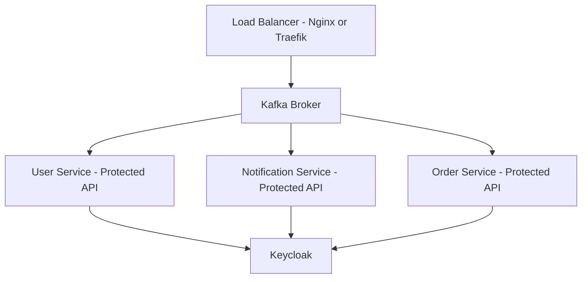

# Event-Driven Microservices Architecture

## Overview

This document outlines a comprehensive microservices architecture that includes:

- **Microservices**:
  - User Service
  - Order Service
  - Notification Service
- **Kafka**: Message broker for asynchronous communication.
- **Keycloak**: Authentication and authorization management.
- **Load Balancer**: Nginx or Traefik for request distribution.
- **OpenAPI**: API documentation.
- **Resilience4j**: Circuit breakers and retry mechanisms.

## Architecture Diagram

```
+-------------------+       +------------------+       +-------------------+
|    Load Balancer  | ----> |    Kafka Broker   | ----> |  Order Service     |
| (Nginx/Traefik)   |       |                  |       | (Protected API)    |
+-------------------+       +------------------+       +-------------------+
                                    |
                                    |
                         +---------------------+
                         |  User Service       |
                         | (Protected API)     |
                         +---------------------+
                                    |
                                    |
                         +---------------------+
                         | Notification Service |
                         | (Protected API)     |
                         +---------------------+
                                    |
                                    |
                            +-----------------+
                            |   Keycloak      |
                            +-----------------+
```



## 1. Setting Up Keycloak

### Install Keycloak

Run Keycloak using Docker:

```bash
docker run -d -p 8080:8080 \
  -e KEYCLOAK_USER=admin \
  -e KEYCLOAK_PASSWORD=admin \
  --name keycloak \
  jboss/keycloak
```

### Configure Realm and Clients

1. **Access Keycloak Admin Console**: Navigate to `http://localhost:8080/auth/admin` and log in.
2. **Create a Realm**: E.g., `myrealm`.
3. **Create Clients** for each microservice (User Service, Order Service, Notification Service) with appropriate settings.
4. **Create Roles** and **Users** as needed.

## 2. Microservices Setup

### User Service

#### Maven Dependencies

Add dependencies to `pom.xml`:

```xml
<dependency>
    <groupId>org.springframework.boot</groupId>
    <artifactId>spring-boot-starter-web</artifactId>
</dependency>
<dependency>
    <groupId>org.springframework.boot</groupId>
    <artifactId>spring-boot-starter-security</artifactId>
</dependency>
<dependency>
    <groupId>org.keycloak</groupId>
    <artifactId>keycloak-spring-boot-starter</artifactId>
    <version>15.0.2</version>
</dependency>
```

#### User Service Application

```java
import org.springframework.boot.SpringApplication;
import org.springframework.boot.autoconfigure.SpringBootApplication;

@SpringBootApplication
public class UserServiceApplication {
    public static void main(String[] args) {
        SpringApplication.run(UserServiceApplication.class, args);
    }
}
```

#### User Controller

```java
import org.springframework.web.bind.annotation.GetMapping;
import org.springframework.web.bind.annotation.RestController;

@RestController
public class UserController {
    @GetMapping("/api/users")
    public String getUsers() {
        return "List of users";
    }
}
```

### Order Service

Follow similar steps as the User Service, ensuring the appropriate endpoints are defined.

### Notification Service

Repeat the same setup with relevant API endpoints.

### Security Configuration

Create a security configuration class in each microservice:

```java
import org.keycloak.adapters.springsecurity.config.KeycloakWebSecurityConfigurerAdapter;
import org.springframework.context.annotation.Bean;
import org.springframework.security.config.annotation.web.builders.HttpSecurity;
import org.springframework.security.config.annotation.web.configuration.EnableWebSecurity;
import org.springframework.security.web.authentication.AuthenticationEntryPoint;

@EnableWebSecurity
public class SecurityConfig extends KeycloakWebSecurityConfigurerAdapter {

    @Override
    protected void configure(HttpSecurity http) throws Exception {
        super.configure(http);
        http.authorizeRequests()
            .antMatchers("/api/users").hasRole("USER")
            .antMatchers("/api/orders").hasRole("USER")
            .anyRequest().permitAll();
    }

    @Bean
    @Override
    protected AuthenticationEntryPoint authenticationEntryPoint() {
        return new KeycloakAuthenticationEntryPoint(adapter());
    }
}
```

### 3. Kafka Setup

Add Kafka producer and consumer logic in each service as needed.

### 4. Adding Load Balancer

#### Using Nginx

Create an Nginx configuration file `nginx.conf`:

```nginx
http {
    upstream user_service {
        server user-service:8080;
        server user-service-2:8080;
    }

    upstream order_service {
        server order-service:8080;
        server order-service-2:8080;
    }

    upstream notification_service {
        server notification-service:8080;
        server notification-service-2:8080;
    }

    server {
        listen 80;

        location /api/users {
            proxy_pass http://user_service;
        }

        location /api/orders {
            proxy_pass http://order_service;
        }

        location /api/notifications {
            proxy_pass http://notification_service;
        }
    }
}
```

#### Docker Configuration for Nginx

Create a Dockerfile for Nginx:

```dockerfile
FROM nginx:alpine
COPY nginx.conf /etc/nginx/nginx.conf
```

### Docker Compose Configuration

Update your `docker-compose.yml` to include the load balancer and multiple service instances:

```yaml
version: '3.8'

services:
  zookeeper:
    image: wurstmeister/zookeeper:3.4.6
    ports:
      - "2181:2181"

  kafka:
    image: wurstmeister/kafka:latest
    ports:
      - "9092:9092"
    environment:
      KAFKA_ZOOKEEPER: zookeeper:2181
      KAFKA_ADVERTISED_LISTENERS: INSIDE://kafka:9093,OUTSIDE://localhost:9092
      KAFKA_LISTENER_SECURITY_PROTOCOL_MAP: INSIDE:PLAINTEXT,OUTSIDE:PLAINTEXT
      KAFKA_LISTENERS: INSIDE://0.0.0.0:9093,OUTSIDE://0.0.0.0:9092
    depends_on:
      - zookeeper

  user-service:
    build: ./user-service
    ports:
      - "8081:8080"

  user-service-2:
    build: ./user-service
    ports:
      - "8084:8080"

  order-service:
    build: ./order-service
    ports:
      - "8082:8080"

  order-service-2:
    build: ./order-service
    ports:
      - "8085:8080"

  notification-service:
    build: ./notification-service
    ports:
      - "8083:8080"

  notification-service-2:
    build: ./notification-service
    ports:
      - "8086:8080"

  nginx:
    build: ./nginx
    ports:
      - "80:80"
    depends_on:
      - user-service
      - order-service
      - notification-service
```

### 5. Testing the Setup

1. **Start Services**:
   Run Docker Compose:

   ```bash
   docker-compose up
   ```

2. **Access the Load Balancer**:
   Use the following URLs:
   - User Service: `http://localhost/api/users`
   - Order Service: `http://localhost/api/orders`
   - Notification Service: `http://localhost/api/notifications`

### 6. Accessing Traefik (Optional)

If using Traefik, add to your `docker-compose.yml` as follows:

```yaml
services:
  traefik:
    image: traefik:v2.4
    command:
      - "--api.insecure=true"
      - "--providers.docker=true"
      - "--entrypoints.web.address=:80"
    ports:
      - "80:80"
      - "8080:8080"
    volumes:
      - "/var/run/docker.sock:/var/run/docker.sock"
```

### Conclusion

This document provides a detailed guide to creating an event-driven microservices architecture using Kafka, Keycloak, and a load balancer. This setup ensures scalability, robustness, and secure access to your services. Customize the configurations according to your specific needs, and enjoy building resilient microservices!

---

Sure! Here's an elaboration on the components of your architecture, focusing on Kafka and its key concepts such as clusters, containers, consumer groups, producers, partitions, offsets, leaders, followers, and more. I'll also update the diagram to reflect these concepts.

```mermaid
graph TD
    A[Load Balancer<br>(Nginx/Traefik)] --> B[Kafka Broker]
    B --> C[Order Service<br>(Protected API)]
    B --> D[User Service<br>(Protected API)]
    B --> E[Notification Service<br>(Protected API)]
    D --> F[Keycloak]
    E --> F
    C --> F

    subgraph Kafka Cluster
        direction TB
        B[Kafka Broker]
        P1[Partition 1]
        P2[Partition 2]
        P3[Partition 3]
        L1[Leader]
        F1[Follower 1]
        F2[Follower 2]
        C1[Consumer Group 1]
        C2[Consumer Group 2]
        Producer[Producer]
        EventStore[Event Store]
        EventBus[Event Bus]
        EventSource[Event Source]
    end

    B --> P1
    B --> P2
    B --> P3
    P1 --> L1
    P1 --> F1
    P1 --> F2
    C1 --> P1
    C2 --> P2
    Producer --> B
    EventStore --> B
    EventBus --> B
    EventSource --> B
```

### Detailed Explanation of Components

#### 1. **Kafka Cluster**
   - **Kafka Broker**: The main server that handles requests from producers and consumers. It is part of a cluster that can have multiple brokers for scalability and fault tolerance.
   - **Partition**: Each Kafka topic is divided into partitions. A partition is a log where records are stored. It allows for parallel processing.
   - **Leader**: For each partition, one broker acts as the leader, responsible for all reads and writes to that partition.
   - **Follower**: Other brokers that replicate the leader's data to provide redundancy. If the leader fails, a follower can take over as the new leader.
   - **Event Store**: A storage layer where events (messages) are kept for a specified retention period. Events can be retrieved for processing.
   - **Event Bus**: A messaging system that facilitates communication between different microservices or systems by publishing and subscribing to events.
   - **Event Source**: The origin of events that trigger processes in the system, often reflecting state changes.

#### 2. **Producers and Consumers**
   - **Producer**: An application or service that sends data (messages/events) to a Kafka topic. Producers can write data to one or more partitions within a topic.
   - **Consumer**: An application or service that reads data from Kafka topics. Consumers can be organized into consumer groups to share the workload.
   - **Consumer Group**: A group of consumers that work together to consume messages from a set of partitions. Each partition is consumed by only one consumer within the group at a time.
   - **Offset**: A unique identifier for each record within a partition. Consumers use offsets to keep track of which messages have been consumed.

#### 3. **Event Handling**
   - **Event Store**: Maintains a log of events that can be replayed, providing a history of changes.
   - **Event Bus**: Acts as a communication layer between microservices, allowing them to publish and subscribe to events asynchronously.
   - **Event Source**: Represents the source from which events are generated, allowing microservices to react to changes in state.

### How It All Works Together
1. **Load Balancer**: Directs incoming requests to the appropriate service based on the defined routing rules.
2. **Kafka Broker**: Acts as a message broker for the microservices, enabling asynchronous communication between them.
3. **Services**: Order Service, User Service, and Notification Service interact with Kafka to send and receive messages. They utilize Keycloak for authentication.
4. **Producers**: These services act as producers, sending events to Kafka topics.
5. **Consumers**: These services consume events from Kafka, allowing for decoupled communication and improved scalability.
6. **Consumer Groups**: By organizing consumers into groups, multiple instances of a service can read from the same topic, ensuring load balancing and fault tolerance.
7. **Data Replication**: Leaders and followers within the Kafka cluster ensure data is replicated for reliability.
8. **Event Handling**: The architecture supports event sourcing, where events can trigger processes across services, leading to a responsive system.

This expanded overview provides a more detailed understanding of how the components in your architecture work together, particularly around the Kafka messaging system. Feel free to adjust any details or add more specific elements based on your use case!

---

Here's a detailed elaboration of the microservices architecture diagram, including concepts like Kafka cluster, consumer groups, partitions, offsets, leaders, followers, and event sourcing.

```mermaid
graph TD
    A[Load Balancer<br>(Nginx/Traefik)] --> B[Kafka Broker]
    B --> C[Order Service<br>(Protected API)]
    B --> D[User Service<br>(Protected API)]
    B --> E[Notification Service<br>(Protected API)]
    D --> F[Keycloak]
    E --> F
    C --> F

    %% Kafka Cluster Components
    subgraph Kafka_Cluster [Kafka Cluster]
        direction TB
        B1[Kafka Broker 1]
        B2[Kafka Broker 2]
        B3[Kafka Broker 3]
        Controller[Controller]
    end

    %% Consumer Groups
    subgraph Consumer_Groups [Consumer Groups]
        direction TB
        CG1[Order Service Consumer Group]
        CG2[User Service Consumer Group]
        CG3[Notification Service Consumer Group]
    end

    %% Topics and Partitions
    subgraph Topics [Topics and Partitions]
        direction TB
        T1[Order Topic]
        P1[P1]
        P2[P2]
        T2[User Topic]
        P3[P3]
        T3[Notification Topic]
        P4[P4]
    end

    %% Connections
    B -->|Produces Messages| T1
    B -->|Produces Messages| T2
    B -->|Produces Messages| T3
    T1 -->|Contains Partitions| P1
    T1 -->|Contains Partitions| P2
    T2 -->|Contains Partitions| P3
    T3 -->|Contains Partitions| P4

    %% Consumer Group Connections
    C -->|Consumes from| CG1
    D -->|Consumes from| CG2
    E -->|Consumes from| CG3

    %% Leader and Follower
    B1 -->|Leader| P1
    B2 -->|Follower| P1
    B3 -->|Follower| P1
    B1 -->|Leader| P2
    B2 -->|Follower| P2

    %% Offset Management
    P1 -->|Offset| O1[Offset Tracker]
    P2 -->|Offset| O2[Offset Tracker]
    P3 -->|Offset| O3[Offset Tracker]
    P4 -->|Offset| O4[Offset Tracker]

    %% Event Store and Event Bus
    B -->|Event Store| ES[Event Store]
    B -->|Event Bus| EB[Event Bus]
```

### Explanation of Key Concepts

1. **Kafka Cluster**: The Kafka cluster consists of multiple brokers (e.g., Broker 1, Broker 2, Broker 3) that work together to handle the load and ensure high availability.

2. **Controller**: The Kafka controller manages the cluster, handling leader election for partitions and ensuring the overall health of the cluster.

3. **Consumer Groups**: Each service (Order, User, Notification) has its own consumer group, which allows multiple instances of a service to process messages from Kafka topics in parallel.

4. **Topics and Partitions**:
   - **Topics**: Categories in which messages are published (e.g., Order Topic, User Topic, Notification Topic).
   - **Partitions**: Each topic can be divided into partitions (e.g., P1, P2) to distribute load across multiple brokers.

5. **Leader and Follower**:
   - Each partition has a leader broker that handles all reads and writes, while followers replicate the data for redundancy.
   - If the leader fails, a follower can take over as the new leader.

6. **Offsets**: Each message within a partition is assigned a unique offset, allowing consumers to track their progress in processing messages.

7. **Event Store and Event Bus**:
   - **Event Store**: A storage mechanism for all events published in the system, allowing for replay and auditing.
   - **Event Bus**: The communication layer through which services publish and subscribe to events.

This architecture ensures a resilient, scalable, and manageable system for handling asynchronous message processing between microservices.

|A|B|C|
|-|-|-|
|More details on Kafka|Microservice patterns|Performance tuning tips|
