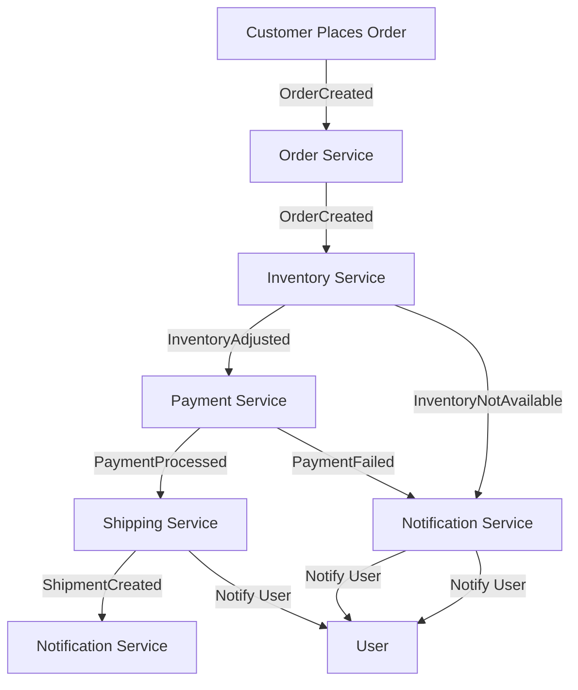

Here's a Mermaid diagram representing the event-driven microservice design pattern for the e-commerce order processing scenario described earlier. You can use this diagram to visualize the interactions between different services and the flow of events.



### Explanation of the Diagram

- **Customer Places Order**: The process begins when the customer places an order.
- **Order Service**: This service creates an order and emits an `OrderCreated` event.
- **Inventory Service**: Listens for the `OrderCreated` event to check product availability and emits either `InventoryAdjusted` or `InventoryNotAvailable`.
- **Payment Service**: Listens for `InventoryAdjusted` to process payment and emits `PaymentProcessed` or `PaymentFailed`.
- **Shipping Service**: Listens for `PaymentProcessed` to create a shipment and emits `ShipmentCreated`.
- **Notification Service**: Listens for `PaymentProcessed`, `PaymentFailed`, and `ShipmentCreated` to notify the user of the order status.

You can render this diagram using a Mermaid live editor or in environments that support Mermaid syntax, such as Markdown documents or certain documentation tools.

---

Here's an example of an event-driven microservice design pattern in the context of an e-commerce application. This scenario will illustrate how different microservices interact through events, ensuring decoupled communication and asynchronous processing.

### Scenario: E-Commerce Order Processing

#### Microservices Involved

1. **Order Service**: Manages order creation and updates.
2. **Inventory Service**: Handles product availability and stock adjustments.
3. **Payment Service**: Processes payments for orders.
4. **Shipping Service**: Manages shipment of orders.
5. **Notification Service**: Sends notifications to users about order status.

### Event Flow

1. **Order Creation**: When a customer places an order, the Order Service emits an `OrderCreated` event.
2. **Inventory Adjustment**: The Inventory Service listens for the `OrderCreated` event, checks product availability, and emits either an `InventoryAdjusted` event (if the product is available) or an `InventoryNotAvailable` event (if not).
3. **Payment Processing**: Upon receiving `InventoryAdjusted`, the Payment Service processes the payment and emits a `PaymentProcessed` event or a `PaymentFailed` event.
4. **Shipping**: If the payment is successful (`PaymentProcessed`), the Shipping Service prepares the shipment and emits a `ShipmentCreated` event.
5. **User Notification**: The Notification Service listens for relevant events (e.g., `PaymentProcessed`, `ShipmentCreated`) to inform the user about the order status.

### Event-Driven Architecture Components

#### 1. Event Bus

An event bus facilitates communication between the microservices. You can use technologies like **RabbitMQ**, **Apache Kafka**, or **NATS** as the event bus.

#### 2. Events

Each service will define the events it produces and consumes. For example:

- **OrderCreated**: `{ "orderId": "123", "userId": "456", "items": [...] }`
- **InventoryAdjusted**: `{ "orderId": "123", "status": "success", "quantity": 1 }`
- **PaymentProcessed**: `{ "orderId": "123", "status": "success" }`
- **ShipmentCreated**: `{ "orderId": "123", "trackingId": "789" }`
- **InventoryNotAvailable**: `{ "orderId": "123", "status": "failure" }`
- **PaymentFailed**: `{ "orderId": "123", "status": "failure" }`

### Example Implementation

#### Order Service

```java
@RestController
@RequestMapping("/orders")
public class OrderService {

    @Autowired
    private EventPublisher eventPublisher;

    @PostMapping
    public ResponseEntity<Order> createOrder(@RequestBody Order order) {
        // Save order to database
        // ...
        
        // Publish OrderCreated event
        eventPublisher.publish(new OrderCreated(order.getId(), order.getUserId(), order.getItems()));
        return ResponseEntity.status(HttpStatus.CREATED).body(order);
    }
}
```

#### Inventory Service

```java
@Component
public class InventoryService {

    @Autowired
    private EventPublisher eventPublisher;

    @EventListener
    public void handleOrderCreated(OrderCreated event) {
        if (checkProductAvailability(event.getItems())) {
            eventPublisher.publish(new InventoryAdjusted(event.getOrderId(), "success", 1));
        } else {
            eventPublisher.publish(new InventoryNotAvailable(event.getOrderId(), "failure"));
        }
    }

    private boolean checkProductAvailability(List<Item> items) {
        // Check stock levels
        return true; // Placeholder
    }
}
```

#### Payment Service

```java
@Component
public class PaymentService {

    @Autowired
    private EventPublisher eventPublisher;

    @EventListener
    public void handleInventoryAdjusted(InventoryAdjusted event) {
        // Process payment
        boolean paymentSuccess = processPayment(event.getOrderId());
        if (paymentSuccess) {
            eventPublisher.publish(new PaymentProcessed(event.getOrderId(), "success"));
        } else {
            eventPublisher.publish(new PaymentFailed(event.getOrderId(), "failure"));
        }
    }

    private boolean processPayment(String orderId) {
        // Call payment gateway
        return true; // Placeholder
    }
}
```

#### Shipping Service

```java
@Component
public class ShippingService {

    @Autowired
    private EventPublisher eventPublisher;

    @EventListener
    public void handlePaymentProcessed(PaymentProcessed event) {
        // Prepare shipment
        String trackingId = createShipment(event.getOrderId());
        eventPublisher.publish(new ShipmentCreated(event.getOrderId(), trackingId));
    }

    private String createShipment(String orderId) {
        // Logic to create shipment
        return "tracking-123"; // Placeholder
    }
}
```

#### Notification Service

```java
@Component
public class NotificationService {

    @EventListener
    public void handlePaymentProcessed(PaymentProcessed event) {
        // Notify user about successful payment
        notifyUser(event.getOrderId(), "Your payment was successful!");
    }

    @EventListener
    public void handleShipmentCreated(ShipmentCreated event) {
        // Notify user about shipment
        notifyUser(event.getOrderId(), "Your order has been shipped!");
    }

    private void notifyUser(String orderId, String message) {
        // Logic to send notification (email, SMS, etc.)
    }
}
```

### Benefits of This Design

- **Decoupled Services**: Each microservice operates independently, responding to events without needing to know about other services.
- **Scalability**: Services can be scaled individually based on their load and responsibilities.
- **Resilience**: If one service fails, it does not directly impact others. The system can recover from partial failures.
- **Flexibility**: New services can be added to respond to existing events without disrupting the current architecture.

### Conclusion

This event-driven microservice design pattern effectively illustrates how services can interact asynchronously, allowing for flexible and scalable architectures. By utilizing events, services maintain loose coupling, enabling easier updates, scaling, and maintenance.

---

### Event Store

An **event store** is a specialized database or storage system that is designed to store events in an event sourcing architecture. Instead of storing just the current state of an entity, an event store keeps a log of all the events that have occurred over time, which can be used to reconstruct the state of an entity at any point in time. 

#### Key Characteristics of an Event Store:

1. **Event Persistence**: Events are stored in the order they are generated, preserving the history of changes.
2. **Immutability**: Once an event is written to the store, it cannot be modified or deleted. This ensures a reliable audit trail.
3. **Event Schema**: Events can have a specific structure, often with fields that describe the action taken, the entity affected, and any relevant data.
4. **Replayability**: The ability to replay events allows the system to reconstruct the state of an entity at any given time by reprocessing the events.

#### Example Event Stores:
- **EventStore**: A popular open-source event store designed for event sourcing.
- **Apache Kafka**: While primarily a messaging system, it can also function as an event store due to its durable log storage.
- **CQRS/Event Sourcing Frameworks**: Various frameworks that provide built-in event storage capabilities.

---

### Event Bus

An **event bus** is a communication mechanism that allows different parts of a system (typically microservices) to publish and subscribe to events. It enables decoupled communication, meaning that the components do not need to know about each other directly; they only need to know about the event bus.

#### Key Characteristics of an Event Bus:

1. **Decoupling**: Services can communicate without being tightly coupled, making it easier to change or scale individual components.
2. **Asynchronous Communication**: Events can be processed asynchronously, allowing for better performance and responsiveness in the system.
3. **Broadcasting**: When an event is published, all interested subscribers can receive it, allowing multiple services to react to the same event.
4. **Flexibility**: New subscribers can be added without altering the existing services.

#### Example Event Buses:
- **RabbitMQ**: A message broker that can be used as an event bus.
- **Apache Kafka**: Also serves as an event bus, allowing services to publish and subscribe to topics.
- **NATS**: A lightweight messaging system that supports pub/sub communication.

---

### Use in Microservices

In a microservices architecture, event stores and event buses play crucial roles in achieving scalability, flexibility, and resilience.

#### 1. Event Store in Microservices:

- **State Management**: Each microservice can maintain its own state based on events, enabling event sourcing. This makes it easy to audit changes and understand the history of state transitions.
- **Reconstruction of State**: If a microservice needs to recover or needs to be rebuilt, it can retrieve its events from the event store to reconstruct its current state.
- **Consistency**: Event stores can help ensure eventual consistency across microservices, as they provide a reliable way to manage state changes.

#### 2. Event Bus in Microservices:

- **Asynchronous Communication**: Microservices can communicate via events without blocking each other, improving performance and scalability.
- **Decoupling Services**: Services can be added, removed, or changed independently, leading to a more maintainable system.
- **Event-Driven Architecture**: The system can react to events in real-time, leading to more dynamic and responsive applications.

### Example Scenario

Imagine an e-commerce platform with multiple microservices:

- **Order Service**: Creates orders and emits an `OrderCreated` event when a new order is placed.
- **Inventory Service**: Subscribes to `OrderCreated` to adjust stock levels.
- **Payment Service**: Subscribes to `OrderCreated` to initiate payment processing.
- **Shipping Service**: Subscribes to `OrderCreated` to prepare for shipment.

In this setup:

- The **event bus** facilitates communication between services, allowing them to react to the `OrderCreated` event asynchronously.
- The **event store** retains the history of orders, allowing any service to reconstruct the state of orders for auditing or troubleshooting.

### Conclusion

Event stores and event buses are fundamental components in modern microservices architectures, enabling efficient communication, state management, and a more resilient system design. They provide the means to implement event-driven patterns, ensuring that services can operate independently while still being responsive to changes in the system.
