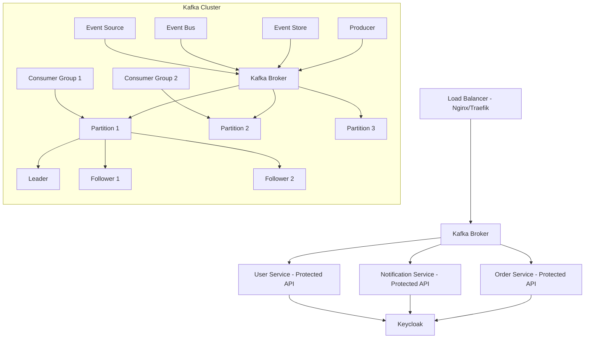

# Microservices Architecture with Kafka

This architecture utilizes Kafka as the messaging backbone, facilitating communication between various microservices. Below, we break down the key components, their relationships, and how they work together.

## Architecture Diagram

## Detailed Explanation of Components

### 1. **Kafka Cluster**
- **Kafka Broker**: The main server handling requests from producers and consumers, facilitating message storage and retrieval.
- **Partition**: Each topic is divided into partitions, allowing for parallel processing and scalability.
- **Leader**: The broker responsible for all reads and writes to a partition.
- **Follower**: Brokers that replicate the leader's data to ensure fault tolerance. If the leader fails, a follower can take over.
- **Event Store**: A persistent log of events/messages, allowing for replay and auditing.
- **Event Bus**: Facilitates communication between microservices by publishing and subscribing to events.
- **Event Source**: The origin of events that trigger processes in the system.

### 2. **Producers and Consumers**
- **Producer**: Services that send data (events/messages) to Kafka topics. They can write to one or more partitions.
- **Consumer**: Services that read data from Kafka topics. Organized into consumer groups to distribute the workload.
- **Consumer Group**: A collection of consumers that work together to consume messages, ensuring that each partition is consumed by only one member of the group at a time.

### 3. **Event Handling**
- **Event Store**: Maintains a history of events for replay and auditing.
- **Event Bus**: Enables asynchronous communication between services, facilitating event-driven architecture.

### How It All Works Together
1. **Load Balancer**: Directs incoming requests to the appropriate service.
2. **Kafka Broker**: Acts as a messaging system, enabling asynchronous communication.
3. **Services**: Each service (Order, User, Notification) communicates with Kafka to send and receive messages, using Keycloak for authentication.
4. **Producers and Consumers**: Services act as both producers and consumers, allowing for decoupled interactions and improved scalability.
5. **Data Replication**: Leaders and followers ensure data reliability within the Kafka cluster.
6. **Event Handling**: The architecture supports event sourcing, allowing services to respond to state changes.

---

This consolidated overview provides a clear understanding of how the microservices architecture leverages Kafka for efficient and scalable messaging between services.
