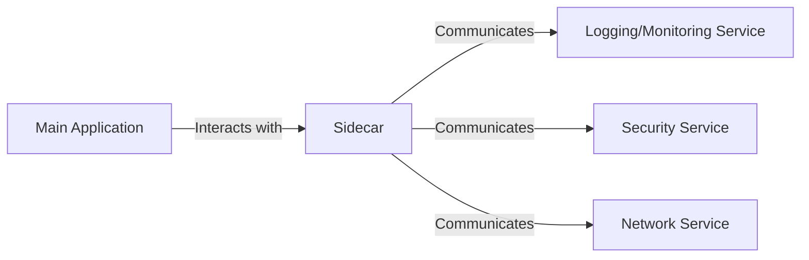

# Sidecar Pattern: A Detailed Design and Architecture Guide


In the dynamic landscape of software architecture, architects and developers are continually seeking innovative patterns and solutions to address the evolving complexities of modern applications. One such pattern that has emerged as a cornerstone in the realm of microservices architectures is the **Sidecar Pattern**. Offering a modular and flexible approach to extending the capabilities of applications, the Sidecar Pattern has garnered significant attention for its ability to enhance modularity, scalability, and resilience without compromising the integrity of the core application.

Deploying application components into separate processes or containers enhances isolation and encapsulation. This approach, often referred to as the Sidecar pattern due to its resemblance to a motorcycle’s sidecar, involves attaching a supplementary component (the sidecar) to the main application. The sidecar offers additional functionalities and supports heterogeneous components and technologies within the application. It operates within the same lifecycle as the parent application, created and retired alongside it. Sometimes known as the sidekick pattern, this approach facilitates the decomposition of the application into manageable parts.

In this article, we embark on a journey to explore the Sidecar Pattern in-depth, uncovering its underlying principles, architectural nuances, and practical applications.

## Understanding the Problem

In the realm of application development, there exists a constant need for auxiliary functionalities like monitoring, logging, configuration, and networking services. These components can either be seamlessly integrated into the application or developed as separate services.

When tightly coupled with the application, these functionalities operate within the same process, optimizing resource utilization. However, this integration poses risks as any malfunction within these components can disrupt other parts of the application. Moreover, they must adhere to the parent application’s programming language, leading to tight interdependence between the components.

Alternatively, decomposing the application into services offers flexibility by allowing the use of different languages and technologies for each service. Nonetheless, this approach introduces challenges. Each component inherits its set of dependencies and requires language-specific libraries, potentially adding latency to the application. Managing diverse codebases and dependencies amplifies complexity in hosting, deployment, and overall management.

## Solution: Sidecar Pattern

The Sidecar Pattern is an architectural design pattern where an additional process, known as the “sidecar,” is attached to the main application or service. This sidecar extends and enhances the functionality of the primary application without directly modifying its codebase. The sidecar process typically runs in the same context as the main application, sharing the same lifecycle and resources.

### Advantages of using a Sidecar Pattern:

- A sidecar is independent of its primary application in terms of runtime environment and programming language, so you don’t need to develop one sidecar per language.
- The sidecar can access the same resources as the primary application. For example, a sidecar can monitor system resources used by both the sidecar and the primary application.
- Because of its proximity to the primary application, there’s no significant latency when communicating between them.
- Even for applications that don’t provide an extensibility mechanism, you can use a sidecar to extend functionality by attaching it as its own process in the same host or sub-container as the primary application.

## Design Principles

The Sidecar Pattern adheres to several design principles that guide its implementation:

- **Modularity**: By separating the auxiliary functionality into a sidecar process, the main application remains focused on its core responsibilities. This modularity promotes code organization and maintainability.
- **Scalability**: Sidecar instances can be independently scaled from the main application, allowing for fine-grained control over resource allocation based on specific requirements.
- **Resilience**: The decoupling provided by the sidecar enhances system resilience. Failures in the sidecar process, such as crashes or resource exhaustion, do not directly impact the main application, reducing the risk of cascading failures.
- **Flexibility**: The Sidecar Pattern enables flexible configuration and deployment options. Different sidecar implementations can be used interchangeably with the same main application, providing versatility in adapting to various environments and requirements.

## Architecture

Let’s explore the architecture of a system employing the Sidecar Pattern:

### Components:

- **Main Application**: The core component of the system responsible for its primary functionality. It remains agnostic of the sidecar and communicates with it through well-defined interfaces.
- **Sidecar**: An auxiliary process attached to the main application. It provides additional features such as logging, monitoring, security, or communication with external services. The sidecar interacts with the main application via local or network interfaces.
- **Communication Channel**: A communication mechanism facilitating interaction between the main application and the sidecar. This can be achieved through inter-process communication (IPC), shared memory, sockets, or HTTP endpoints, depending on the specific requirements of the system.
- **Infrastructure**: The underlying infrastructure that hosts both the main application and the sidecar. This could include container orchestration platforms like Kubernetes, virtual machines, or bare-metal servers.

### Flowchart



## Issues and Considerations

When implementing the Sidecar Pattern, several factors merit consideration to ensure effective deployment and optimal performance:

- **Deployment and Packaging**: Selecting the appropriate deployment and packaging format is crucial. Containers, given their lightweight and portable nature, align well with the sidecar pattern. They offer the necessary isolation and encapsulation for deploying sidecar services alongside the main application.
- **Interprocess Communication**: Choose the interprocess communication mechanism thoughtfully when designing a sidecar service. Opt for language- or framework-agnostic technologies where feasible, unless specific performance requirements dictate otherwise. This approach enhances flexibility and interoperability across different components.
- **Functionality Placement**: Before integrating functionality into a sidecar, evaluate whether it might be better suited as a separate service or a traditional daemon. Consider factors such as ownership, scalability, and architectural simplicity. Additionally, explore the possibility of implementing functionality as a library or utilizing traditional extension mechanisms, especially if language-specific integrations or lower network overhead are priorities.

## When to Use the Sidecar Pattern

The Sidecar Pattern finds application in various scenarios across different domains:

- **Logging and Monitoring**: The sidecar can intercept application logs and metrics, forwarding them to centralized logging and monitoring systems. This offloads these cross-cutting concerns from the main application, keeping its codebase clean and focused.
- **Security**: Sidecars can handle security-related tasks such as authentication, authorization, and encryption. They can enforce security policies without burdening the main application with these responsibilities.
- **Service Mesh**: In microservices architectures, sidecars are often used as proxies within a service mesh. They handle communication between services, implement service discovery, and enforce policies such as circuit breaking and retry logic.
- **Data Transformation**: Sidecars can perform data transformation tasks such as format conversion, compression, or encryption before data is transmitted or stored by the main application.
- **Resource Management**: When fine-grained control over resource limits for specific components is necessary, deploying them as sidecars enables independent management of resource usage, such as memory allocation.
- **Remote Ownership**: If a component is managed by a remote team or a different organization, employing a sidecar service fosters collaboration and integration without imposing constraints on language or framework choices.

### This pattern may not be suitable

However, the sidecar pattern may not be suitable in the below scenarios:

- **Optimization Requirements**: If optimization of interprocess communication is paramount, the overhead introduced by communication between the parent application and sidecar services, notably latency, may not be acceptable. In such cases, alternative architectural patterns may be more appropriate.
- **Resource Considerations**: For small-scale applications where the resource overhead of deploying a sidecar service for each instance outweighs the benefits of isolation, alternative deployment strategies should be explored.
- **Scalability Requirements**: If the service needs to scale differently from or independently of the main application, deploying the feature as a separate service may be preferable, allowing for more granular scalability control.

## Conclusion

The Sidecar Pattern offers a powerful mechanism for extending the functionality of applications while maintaining modularity, scalability, and resilience. Decoupling auxiliary concerns into separate processes promotes clean architecture and enhances the adaptability of systems to changing requirements and environments. Whether employed in logging, monitoring, security, or communication, the Sidecar Pattern continues to be a valuable tool in the arsenal of software architects and developers navigating the complexities of modern distributed systems.

---

Here's a complete example of the Sidecar Pattern, including code snippets that illustrate how to implement a sidecar service in a microservices architecture.

## Example Code

### Main Application: Order Service

This service handles order creation and delegates logging to a sidecar.

```java
// OrderService.java

import org.springframework.web.bind.annotation.*;
import org.slf4j.Logger;
import org.slf4j.LoggerFactory;

@RestController
@RequestMapping("/orders")
public class OrderService {

    private static final Logger logger = LoggerFactory.getLogger(OrderService.class);

    @PostMapping
    public String createOrder(@RequestBody Order order) {
        // Process the order
        logger.info("Order created: " + order);
        // Call the sidecar logging service (mocked here)
        // Sidecar might forward this to a logging service
        return "Order created successfully!";
    }
}
```

### Order Model

```java
// Order.java

public class Order {
    private String id;
    private String product;
    private int quantity;

    // Getters and Setters
}
```

### Sidecar Service: Logging Service

This service handles logging and runs alongside the main application.

```java
// LoggingService.java

import org.springframework.web.bind.annotation.*;
import org.slf4j.Logger;
import org.slf4j.LoggerFactory;

@RestController
@RequestMapping("/logs")
public class LoggingService {

    private static final Logger logger = LoggerFactory.getLogger(LoggingService.class);

    @PostMapping
    public String log(@RequestBody String message) {
        logger.info("Log message: " + message);
        return "Logged successfully!";
    }
}
```

### Docker Compose Configuration

You can use Docker Compose to define both services, enabling them to communicate as sidecars.

```yaml
version: '3'
services:
  order-service:
    build: ./order-service
    ports:
      - "8080:8080"

  logging-service:
    build: ./logging-service
    ports:
      - "8081:8081"
```

### Communication Example

In the Order Service, when an order is created, a log entry is sent to the Sidecar Logging Service.

```java
import org.springframework.web.client.RestTemplate;

@Autowired
private RestTemplate restTemplate;

public String createOrder(@RequestBody Order order) {
    // Process the order
    logger.info("Order created: " + order);
    
    // Call the sidecar logging service
    String logMessage = "Order created: " + order;
    restTemplate.postForEntity("http://localhost:8081/logs", logMessage, String.class);

    return "Order created successfully!";
}
```

### Spring Boot Configuration

Make sure to configure `RestTemplate` as a bean.

```java
// AppConfig.java

import org.springframework.context.annotation.Bean;
import org.springframework.context.annotation.Configuration;
import org.springframework.web.client.RestTemplate;

@Configuration
public class AppConfig {
    @Bean
    public RestTemplate restTemplate() {
        return new RestTemplate();
    }
}
```

## Summary

This example demonstrates a simple implementation of the Sidecar Pattern using two microservices: an Order Service and a Logging Service. The Order Service processes orders and delegates logging to the Logging Service, which runs as a sidecar. This pattern enhances modularity and allows for independent scaling and deployment of each service.
